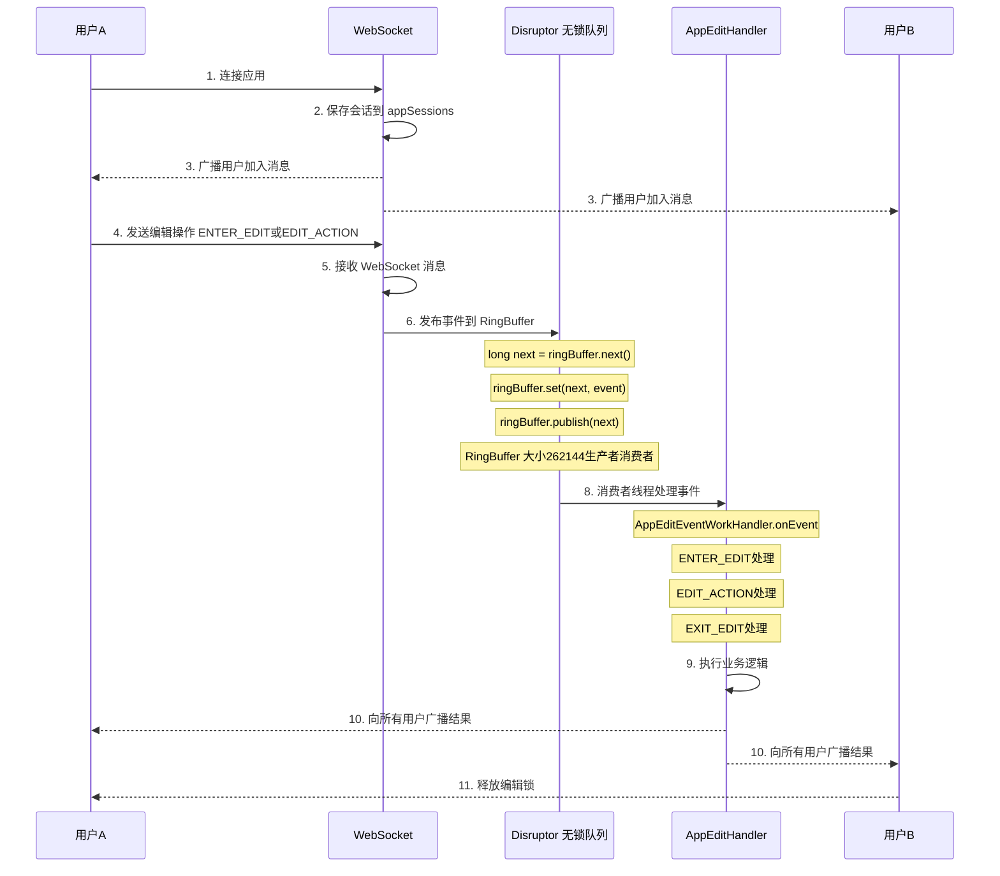
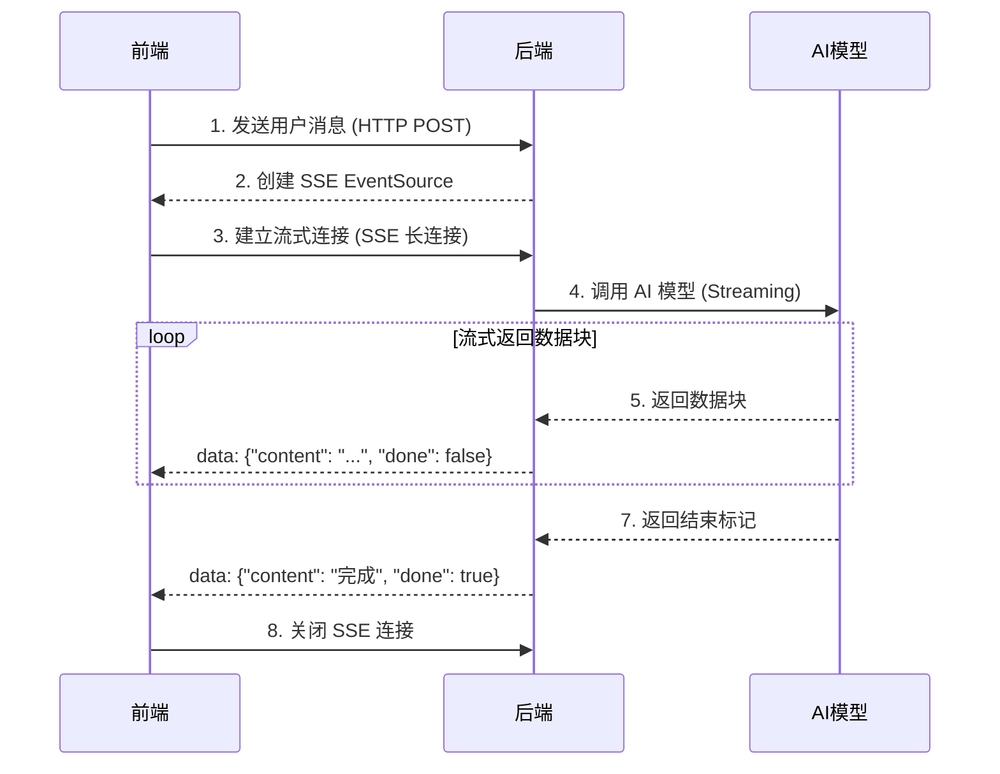
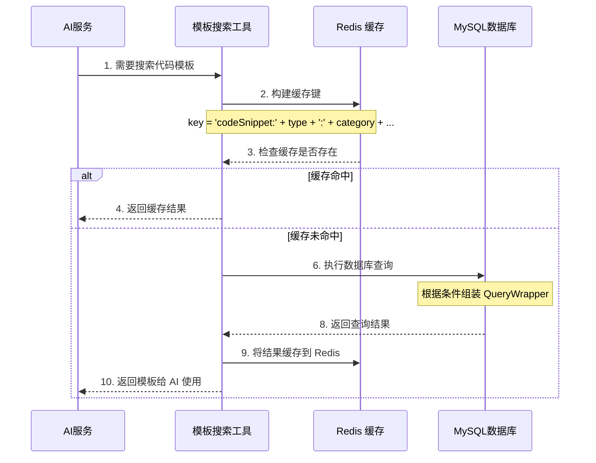
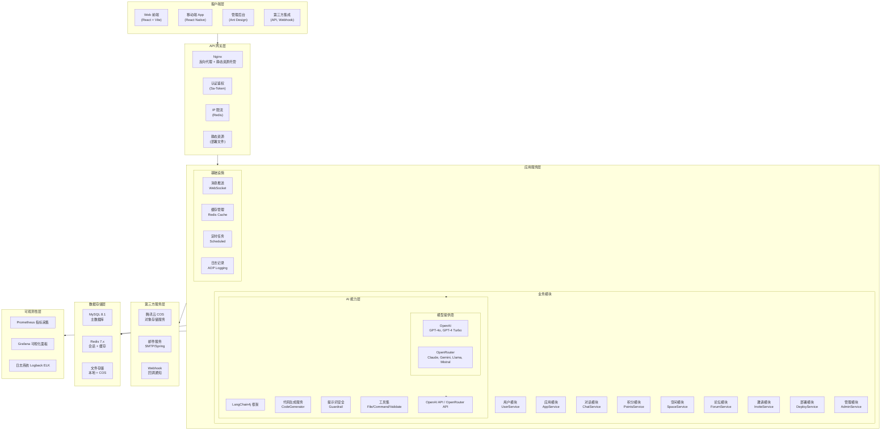
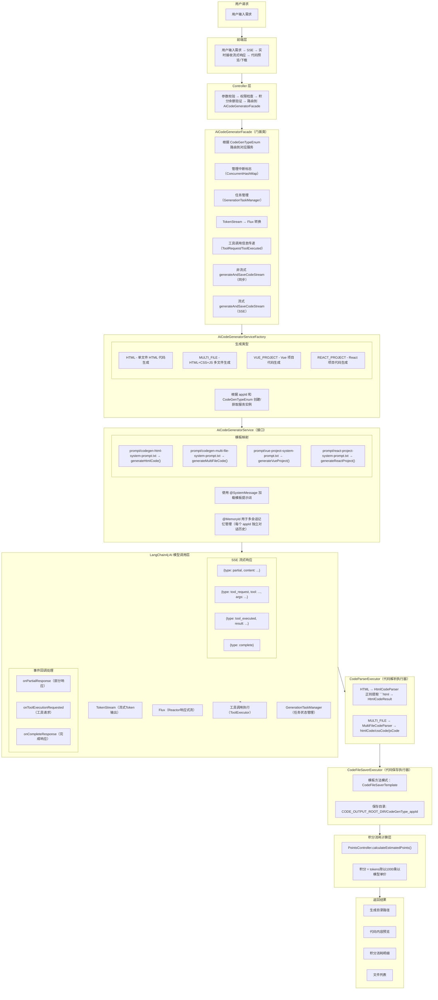
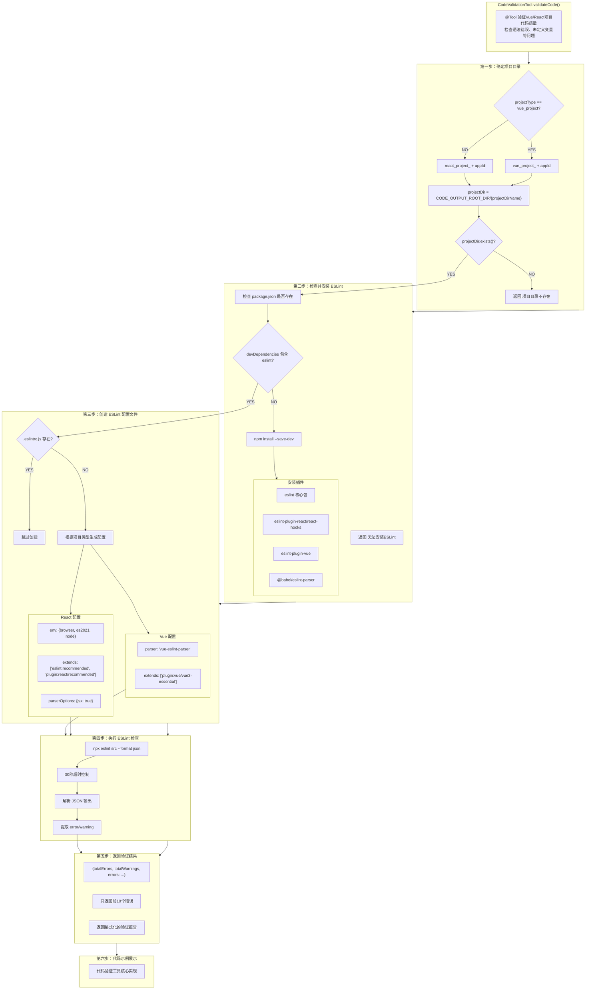
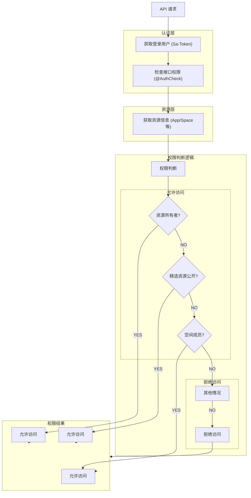

# AI Code - 智能代码生成平台

<div align="center">


[](https://spring.io/projects/spring-boot)
[](https://www.oracle.com/java/)
[](https://reactjs.org/)
[](LICENSE)

**基于 AI 大模型的智能代码生成与协作平台**

[English README](README_EN.md) | [功能特性](#功能特性) | [快速开始](#环境配置与启动) | [在线演示](https://ai-code.example.com)

</div>

---

## 目录

- [项目概述](#项目概述)
- [功能特性](#功能特性)
- [系统架构](#系统架构)
- [核心技术栈](#核心技术栈)
- [快速开始](#环境配置与启动)
- [使用指南](#使用指南)
- [项目结构](#项目结构)
- [API 文档](#api-文档)
- [监控配置](#监控配置)
- [贡献指南](#贡献指南)
- [常见问题](#常见问题)
- [许可证](#许可证)

---

## 项目概述

### 背景介绍

AI Code 是一个企业级智能代码生成与协作平台，旨在利用人工智能技术提升软件开发效率。随着大语言模型（LLM）技术的快速发展，我们看到了将 AI 能力与软件开发流程深度结合的巨大潜力。本项目提供了一个完整的解决方案，涵盖从代码生成、多模型支持、团队协作到积分管理的全流程功能。

传统的代码生成工具往往只关注单一场景，缺乏企业级的权限管理、团队协作和成本控制能力。AI Code 正是为解决这些痛点而设计，我们希望构建一个既能满足个人开发者需求，又适合企业团队使用的综合性平台。

### 核心目标

本项目致力于实现以下核心目标：第一，提供高质量的 AI 代码生成能力，支持多种主流大语言模型；第二，建立完善的权限管理体系，支持空间、角色、成员等多维度权限控制；第三，实现精细化的资源管理，通过积分系统控制 AI 接口调用成本；第四，构建友好的用户界面，提供 Web 端和移动端双端体验；第五，支持部署和分享，让用户能够将生成的应用快速部署上线。

### 应用场景

AI Code 适用于多种实际应用场景。对于个人开发者而言，它可以作为智能编程助手，帮助快速生成样板代码、调试程序、编写文档。在企业团队场景中，平台支持空间协作，多个成员可以在同一个空间内共同开发、分享应用。教育培训领域可以利用平台进行编程教学，学生可以通过 AI 辅助学习各种编程技术。创业团队则可以借助快速原型能力验证产品想法，缩短开发周期。

---

## 功能特性

### 智能代码生成

平台采用模块化的代码生成架构，支持多种代码生成策略。核心代码生成引擎基于 LangChain4j 框架构建，能够灵活适配不同的大模型提供商。用户可以通过自然语言描述需求，系统自动生成完整的代码实现。生成结果支持多文件输出，满足复杂项目的需求。同时，平台集成了代码片段搜索功能，可以在生成过程中参考已有代码库，提高代码质量和一致性。

### 多人协作可视化编辑

平台提供了强大的多人协作可视化编辑功能，支持实时同步编辑体验。通过 WebSocket 长连接技术和 LMAX Disruptor 无锁队列，多个用户可以同时查看和编辑同一个应用。当一个用户进入编辑模式时，系统会自动锁定编辑权限，防止编辑冲突。所有编辑操作（元素选中、悬停、修改）都会通过无锁队列实时广播给其他在线用户，实现所见即所得的协作效果。无锁队列采用单生产者多消费者模式，确保高并发场景下的高性能和低延迟。系统使用 262144（1024*256）大小的 RingBuffer，足够应对大规模并发编辑场景。在线用户列表实时更新，用户可以清晰看到当前有哪些人正在查看或编辑该应用。这种协作模式特别适合团队评审、远程协作和教学演示等场景。

**协作编辑架构流程：**



**核心代码实现：**

```java
// WebSocket 处理器核心代码
@Component
public class AppEditHandler extends TextWebSocketHandler {

    // 记录每个应用的编辑状态（同一时间只有一个用户可以编辑）
    private final Map<Long, Long> appEditingUsers = new ConcurrentHashMap<>();

    // 保存所有连接的 WebSocket 会话
    private final Map<Long, Set<WebSocketSession>> appSessions = new ConcurrentHashMap<>();

    // 保存每个应用的编辑记录（新加入用户可看到历史）
    private final Map<Long, List<TextMessage>> appEditRecodes = new ConcurrentHashMap<>();

    @Resource
    private AppEditEventProducer appEditEventProducer;

    @Override
    public void afterConnectionEstablished(WebSocketSession session) {
        User user = (User) session.getAttributes().get("user");
        Long appId = (Long) session.getAttributes().get("appId");

        // 将用户会话添加到应用的会话集合
        appSessions.computeIfAbsent(appId, k -> ConcurrentHashMap.newKeySet());
        appSessions.get(appId).add(session);

        // 广播"用户加入"消息
        broadcastToApp(appId, createJoinMessage(user));
    }

    @Override
    protected void handleTextMessage(WebSocketSession session, TextMessage message) {
        DialogueRequestMessage requestMessage = JSONUtil.toBean(message.getPayload(), DialogueRequestMessage.class);
        User user = (User) session.getAttributes().get("user");
        Long appId = (Long) session.getAttributes().get("appId");

        // 发布到 Disruptor 无锁队列处理
        appEditEventProducer.publishEvent(requestMessage, session, user, appId);
    }

    // 处理进入编辑请求
    public void handleEnterEditMessage(AppEditContext context) {
        Long appId = context.getAppId();
        User user = context.getUser();

        // 检查是否已有用户正在编辑
        if (appEditingUsers.containsKey(appId)) {
            sendErrorMessage(context.getSession(), "当前有其他用户正在编辑");
            return;
        }

        // 锁定编辑权限
        appEditingUsers.put(appId, user.getId());

        // 广播编辑状态给所有用户
        broadcastToApp(appId, createEditingMessage(user));
    }
}
```

**Disruptor 无锁队列配置：**

```java
// Disruptor 配置类
@Configuration
public class AppEditEventDisruptorConfig {

    @Resource
    private AppEditEventWorkHandler appEditEventWorkHandler;

    @Bean("appEditEventDisruptor")
    public Disruptor<AppEditEvent> messageModelRingBuffer() {
        // RingBuffer 大小：1024 * 256 = 262144
        int bufferSize = 1024 * 256;

        // 创建 Disruptor 实例
        Disruptor<AppEditEvent> disruptor = new Disruptor<>(
                AppEditEvent::new,                    // 事件工厂
                bufferSize,                           // 缓冲区大小
                ThreadFactoryBuilder.create()
                        .setNamePrefix("appEditEventDisruptor")
                        .build()                      // 线程工厂
        );

        // 设置消费者（工作处理器池）
        disruptor.handleEventsWithWorkerPool(appEditEventWorkHandler);

        // 启动 Disruptor
        disruptor.start();

        return disruptor;
    }
}
```

**事件生产者（发布消息到队列）：**

```java
// 事件生产者
@Component
@Slf4j
public class AppEditEventProducer {

    @Resource
    Disruptor<AppEditEvent> appEditEventDisruptor;

    /**
     * 发布编辑事件到 Disruptor 队列
     *
     * @param requestMessage 请求消息
     * @param session WebSocket 会话
     * @param user 当前用户
     * @param appId 应用ID
     */
    public void publishEvent(DialogueRequestMessage requestMessage,
                            WebSocketSession session,
                            User user,
                            Long appId) {
        RingBuffer<AppEditEvent> ringBuffer = appEditEventDisruptor.getRingBuffer();

        // 1. 获取下一个可写入位置
        long next = ringBuffer.next();

        try {
            // 2. 获取事件对象
            AppEditEvent event = ringBuffer.get(next);

            // 3. 填充事件数据
            event.setSession(session);
            event.setPictureEditRequestMessage(requestMessage);
            event.setUser(user);
            event.setAppId(appId);

        } finally {
            // 4. 发布事件
            ringBuffer.publish(next);
        }
    }

    /**
     * 优雅停机
     */
    @PreDestroy
    public void close() {
        appEditEventDisruptor.shutdown();
    }
}
```

**事件对象定义：**

```java
// 编辑事件
@Data
public class AppEditEvent {

    /**
     * WebSocket 请求消息
     */
    private DialogueRequestMessage pictureEditRequestMessage;

    /**
     * 当前用户的会话
     */
    private WebSocketSession session;

    /**
     * 当前用户
     */
    private User user;

    /**
     * 应用ID
     */
    private Long appId;
}
```

**事件消费者（处理队列消息）：**

```java
// 事件消费者
@Slf4j
@Component
public class AppEditEventWorkHandler implements WorkHandler<AppEditEvent> {

    @Resource
    @Lazy
    private AppEditHandler appEditHandler;

    @Resource
    private UserService userService;

    /**
     * 处理编辑事件
     *
     * @param event 编辑事件
     */
    @Override
    public void onEvent(AppEditEvent event) {
        DialogueRequestMessage requestMessage = event.getPictureEditRequestMessage();
        WebSocketSession session = event.getSession();
        User user = event.getUser();
        Long appId = event.getAppId();

        // 获取消息类型
        String type = requestMessage.getType();
        DialogueMessageTypeEnum messageType = DialogueMessageTypeEnum.getEnumByValue(type);

        // 构建编辑上下文
        AppEditContext context = new AppEditContext(requestMessage, session, user, appId);

        // 根据消息类型分发处理
        switch (messageType) {
            case ENTER_EDIT:
                appEditHandler.handleEnterEditMessage(context);
                break;
            case EDIT_ACTION:
                appEditHandler.handleEditActionMessage(context);
                break;
            case EXIT_EDIT:
                appEditHandler.handleExitEditMessage(context);
                break;
            case SEND_MESSAGE:
                appEditHandler.handleSendMessage(context);
                break;
            case HOVER_ELEMENT:
                appEditHandler.handleHoverElement(context);
                break;
            case SELECT_ELEMENT:
                appEditHandler.handleSelectElement(context);
                break;
            case CLEAR_ELEMENT:
                appEditHandler.handleClearElement(context);
                break;
            case DEPLOY_PROJECT:
                appEditHandler.handleDeployProject(context);
                break;
            case STOP_RESPONSE:
                appEditHandler.handleStopResponse(context);
                break;
            default:
                // 错误处理
                sendErrorMessage(session, user, "未知消息类型: " + type);
        }
    }

    private void sendErrorMessage(WebSocketSession session, User user, String errorMsg) {
        DialogueResponseMessage response = new DialogueResponseMessage();
        response.setType(DialogueMessageTypeEnum.ERROR.getValue());
        response.setMessage(errorMsg);
        response.setUser(userService.getUserVO(user));
        try {
            session.sendMessage(new TextMessage(JSONUtil.toJsonStr(response)));
        } catch (Exception e) {
            log.error("发送错误消息失败", e);
        }
    }
}
```

**Disruptor 无锁队列优势说明：**

| 特性 | 传统队列 | Disruptor 无锁队列 |
|------|---------|-------------------|
| 锁机制 | synchronized 或 ReentrantLock | 无锁（CAS + RingBuffer） |
| 内存布局 | 链表节点，分散内存 | 连续数组，预分配内存 |
| 伪共享 | 存在 | 通过缓存行填充避免 |
| 吞吐量 | 中等（万级 QPS） | 高（百万级 QPS） |
| 延迟 | 较高 | 微秒级 |
| 适用场景 | 一般并发 | 高性能场景 |

```typescript
// 前端 WebSocket 客户端实现
export default class AppEditWebSocket {
  private appId: string;
  private socket: WebSocket | null;
  private eventHandlers: any;

  connect() {
    const isDev = import.meta.env.MODE === 'development';
    const wsUrl = isDev
      ? `ws://localhost:8123/api/ws/app/edit?appId=${this.appId}`
      : `${window.location.protocol === 'https:' ? 'wss:' : 'ws://'}${window.location.host}/api/ws/app/edit?appId=${this.appId}`;

    this.socket = new WebSocket(wsUrl);

    this.socket.onopen = () => {
      console.log('WebSocket 连接已建立');
      this.triggerEvent('open');
    };

    this.socket.onmessage = (event) => {
      const message = JSON.parse(event.data);
      const type = message.type;
      this.triggerEvent(type, message);
    };

    this.socket.onclose = () => this.triggerEvent('close');
    this.socket.onerror = (error) => this.triggerEvent('error', error);
  }

  sendMessage(message: any) {
    if (this.socket?.readyState === WebSocket.OPEN) {
      this.socket.send(JSON.stringify(message));
    }
  }
}
```

### 实时对话与流式响应

平台支持与 AI 进行实时对话，采用 Server-Sent Events（SSE）技术实现流式响应。用户输入需求后，AI 会实时生成代码并流式返回，用户无需等待完整响应即可看到生成进度。对话历史自动保存，用户可以回顾和继续之前的对话。系统支持多轮对话上下文记忆，确保 AI 能够理解对话连贯性。前端提供了对话标签页，显示消息列表、加载状态和输入框，支持消息发送和接收的实时交互。移动端同样提供了完整的对话功能，支持在移动设备上进行 AI 代码生成对话。

**流式响应流程：**



**核心代码实现：**

```java
// 流式聊天模型配置
@Configuration
@ConfigurationProperties(prefix = "langchain4j.open-ai.streaming-chat-model")
@Data
public class StreamingChatModelConfig {

    private String baseUrl;
    private String apiKey;
    private String modelName;
    private Integer maxTokens;
    private Double temperature;

    @Bean
    @Scope("prototype")
    public StreamingChatModel streamingChatModelPrototype() {
        return OpenAiStreamingChatModel.builder()
                .apiKey(apiKey)
                .baseUrl(baseUrl)
                .modelName(modelName)
                .maxTokens(maxTokens)
                .temperature(temperature)
                .logRequests(true)
                .logResponses(true)
                .listeners(List.of(aiModelMonitorListener))
                .build();
    }
}
```

```typescript
// 前端 SSE 流式处理实现
const handleSendMessage = async () => {
  const text = inputText.trim();
  if (!text) return;

  setLoading(true);
  setInputText('');

  // 构建 SSE 请求 URL
  const url = `${baseURL}/app/chat/gen/code?appId=${appId}&message=${encodeURIComponent(text)}`;

  let aiResponse = '';
  let closed = false;
  let streamCompleted = false;

  const eventSource = new EventSource(url);

  eventSource.onmessage = (event) => {
    if (closed) return;

    const data = JSON.parse(event.data);

    if (data.done) {
      streamCompleted = true;
      eventSource.close();
      closed = true;
      setLoading(false);
      return;
    }

    if (data.content) {
      aiResponse += data.content;
      setMessages(prev => {
        const lastMsg = prev[prev.length - 1];
        if (lastMsg?.messageType === 'ai') {
          return [...prev.slice(0, -1), { ...lastMsg, messageContent: aiResponse }];
        }
        return [...prev, { id: aiMessageId, messageType: 'ai', messageContent: aiResponse }];
      });
    }
  };

  eventSource.onerror = () => {
    if (!streamCompleted) {
      eventSource.close();
      closed = true;
      setLoading(false);
    }
  };
};
```

### 代码模板库

平台内置了丰富的代码模板库，涵盖多种编程语言和场景。代码模板按类型分类（如组件、布局、动画、工具类等），支持按分类、描述、使用场景和标签进行灵活搜索。每个模板都包含完整的代码片段、使用说明和优先级设置。AI 在生成代码时，会根据需求智能匹配相关模板作为参考，提高生成质量和一致性。管理员可以在后台管理代码模板，包括添加新模板、编辑现有模板、设置模板优先级等操作。模板库支持启用/禁用状态控制，可以灵活管理模板的可用性。

**模板搜索流程：**



**核心代码实现：**

```java
// 代码片段搜索工具（带缓存）
@Component
public class CodeSnippetSearchTool extends BaseTool {

    @Resource
    private CodeSnippetService codeSnippetService;

    // Spring Cache 缓存，减少重复查询
    @Cacheable(
            value = "tool-results",
            key = "'codeSnippet:' + #snippetType + ':' + #snippetCategory + ':' + #snippetDesc + ':' + #usageScenario + ':' + #tags + ':' + #limit",
            unless = "#result == null || #result.isEmpty()"
    )
    @Tool("查询代码片段模板，根据类型、分类、描述、使用场景或标签搜索适合的代码模板")
    public List<CodeSnippet> searchCodeSnippets(
            @P("代码片段类型") String snippetType,
            @P("代码片段分类") String snippetCategory,
            @P("代码片段描述关键词") String snippetDesc,
            @P("使用场景关键词") String usageScenario,
            @P("标签") String tags,
            @P("返回数量限制") Integer limit
    ) {
        QueryWrapper<CodeSnippet> queryWrapper = new QueryWrapper<>();

        // 多条件组合查询
        if (StrUtil.isNotBlank(snippetType)) {
            queryWrapper.eq("snippetType", snippetType);
        }
        if (StrUtil.isNotBlank(snippetCategory)) {
            queryWrapper.eq("snippetCategory", snippetCategory);
        }
        if (StrUtil.isNotBlank(snippetDesc)) {
            queryWrapper.like("snippetDesc", snippetDesc);
        }
        if (StrUtil.isNotBlank(usageScenario)) {
            queryWrapper.like("usageScenario", usageScenario);
        }
        if (StrUtil.isNotBlank(tags)) {
            String[] tagArray = tags.split(",");
            queryWrapper.and(w -> {
                for (String tag : tagArray) {
                    w.like("tags", tag.trim());
                }
            });
        }

        // 只查询启用的模板
        queryWrapper.eq("isActive", 1);
        queryWrapper.eq("isDelete", 0);
        queryWrapper.orderByDesc("priority");
        queryWrapper.orderByDesc("createTime");

        if (limit == null || limit <= 0) limit = 10;
        if (limit > 50) limit = 50;
        queryWrapper.last("LIMIT " + limit);

        return codeSnippetService.list(queryWrapper);
    }
}
```

**数据库表结构：**

```sql
CREATE TABLE `code_snippet` (
  `id` bigint NOT NULL AUTO_INCREMENT COMMENT '片段ID',
  `snippetName` varchar(200) NOT NULL COMMENT '代码片段名称',
  `snippetType` varchar(50) NOT NULL COMMENT '代码片段类型',
  `snippetCategory` varchar(50) NOT NULL COMMENT '代码片段分类',
  `snippetDesc` text COMMENT '代码片段描述',
  `snippetCode` longtext NOT NULL COMMENT '代码片段内容',
  `usageScenario` text COMMENT '使用场景',
  `tags` varchar(500) COMMENT '标签，逗号分隔',
  `isActive` tinyint DEFAULT 1 COMMENT '是否启用：0-禁用，1-启用',
  `priority` int DEFAULT 0 COMMENT '优先级，数字越大优先级越高',
  `creatorId` bigint COMMENT '创建者ID',
  `createTime` datetime DEFAULT CURRENT_TIMESTAMP,
  `updateTime` datetime DEFAULT CURRENT_TIMESTAMP ON UPDATE CURRENT_TIMESTAMP,
  `isDelete` tinyint DEFAULT 0 COMMENT '是否删除',
  PRIMARY KEY (`id`)
) ENGINE=InnoDB DEFAULT CHARSET=utf8mb4 COMMENT='代码片段模板表';
```

### 智能工具调用与缓存

平台实现了智能工具调用系统，AI 可以根据需求自动调用各种工具（如文件读写、命令执行、代码验证等）。工具调用结果会被缓存到 Redis 中，使用 Spring Cache 机制进行管理，避免重复调用相同工具导致的性能开销。系统支持多种缓存策略：默认缓存 30 分钟、快速缓存 5 分钟、长时缓存 60 分钟。模型配置、代码生成服务等核心组件都实现了缓存机制，显著提升系统响应速度。缓存键使用 MD5 哈希算法生成，确保唯一性和高效性。同时，系统实现了 IP 限流功能，基于 Redis 实现分布式限流，保护系统免受恶意请求攻击。

**缓存架构流程：**

```
┌─────────────────────────────────────────────────────────────────────────────────────────┐
│                            智能工具调用与缓存流程                                          │
└─────────────────────────────────────────────────────────────────────────────────────────┘

    请求方                                              缓存层                           数据源
      │                                                   │                              │
      │  1. 发起请求 (带参数)                              │                              │
      │ ─────────────────────────────────────────────────>│                              │
      │                                                   │                              │
      │                  2. 生成缓存键                     │                              │
      │                  key = MD5(JSON(params))          │                              │
      │                                                   │                              │
      │                  3. 查询缓存                       │                              │
      │                                                   │<─────────────────────────────
      │                                                   │   GET cacheKey
      │                                                   │                              │
      │                  4. 缓存命中？                     │                              │
      │                                                   │                              │
      │              YES │                                │                              │
      │                  │                                │                              │
      │                  5. 返回缓存数据                   │                              │
      │ <─────────────────────────────────────────────────│<──────────────────────────────
      │                                                   │                              │
      │              NO ─────────────────────────────────>│                              │
      │                  │                                │                              │
      │                  6. 执行实际业务逻辑               │                              │
      │                  (数据库查询/API调用/工具执行)     │                              │
      │                                                   │                              │
      │                  7. 存储到缓存                     │                              │
      │                                                   │─────────────────────────────>│
      │                                                   │   SETEX cacheKey TTL value
      │                                                   │                              │
      │                  8. 返回结果                       │                              │
      │ <─────────────────────────────────────────────────│                              │
```

**多级缓存策略配置：**

```java
// Redis 缓存管理器配置
@Configuration
public class RedisCacheManagerConfig {

    @Resource
    private RedisConnectionFactory redisConnectionFactory;

    // 默认缓存：30分钟
    @Bean
    @Primary
    public CacheManager cacheManager() {
        ObjectMapper objectMapper = new ObjectMapper();
        objectMapper.registerModule(new JavaTimeModule());
        objectMapper.activateDefaultTyping(LaissezFaireSubTypeValidator.instance,
                ObjectMapper.DefaultTyping.NON_FINAL, JsonTypeInfo.As.PROPERTY);

        RedisCacheConfiguration defaultConfig = RedisCacheConfiguration.defaultCacheConfig()
                .entryTtl(Duration.ofMinutes(30))
                .disableCachingNullValues()
                .serializeKeysWith(RedisSerializationContext.SerializationPair
                        .fromSerializer(new StringRedisSerializer()))
                .serializeValuesWith(RedisSerializationContext.SerializationPair
                        .fromSerializer(new GenericJackson2JsonRedisSerializer(objectMapper)));

        return RedisCacheManager.builder(redisConnectionFactory)
                .cacheDefaults(defaultConfig)
                .withCacheConfiguration("good_app_page",
                        defaultConfig.entryTtl(Duration.ofMinutes(5)))
                .build();
    }

    // 长时缓存：60分钟
    @Bean("longTtlCacheManager")
    public CacheManager longTtlCacheManager() {
        RedisCacheConfiguration config = RedisCacheConfiguration.defaultCacheConfig()
                .entryTtl(Duration.ofMinutes(60))
                .disableCachingNullValues()
                .serializeKeysWith(RedisSerializationContext.SerializationPair
                        .fromSerializer(new StringRedisSerializer()));

        return RedisCacheManager.builder(redisConnectionFactory)
                .cacheDefaults(config)
                .build();
    }

    // 短时缓存：5分钟
    @Bean("shortTtlCacheManager")
    public CacheManager shortTtlCacheManager() {
        RedisCacheConfiguration config = RedisCacheConfiguration.defaultCacheConfig()
                .entryTtl(Duration.ofMinutes(5))
                .disableCachingNullValues()
                .serializeKeysWith(RedisSerializationContext.SerializationPair
                        .fromSerializer(new StringRedisSerializer()));

        return RedisCacheManager.builder(redisConnectionFactory)
                .cacheDefaults(config)
                .build();
    }
}
```

**模型工厂缓存实现（Caffeine + Redis）：**

```java
// 动态 AI 模型工厂（双层缓存）
@Service
@Slf4j
public class DynamicAiModelFactory {

    // 本地缓存（Caffeine）- 一级缓存
    private final Cache<String, StreamingChatModel> modelCache = Caffeine.newBuilder()
            .maximumSize(100)
            .expireAfterWrite(Duration.ofMinutes(30))    // 写入 30 分钟后过期
            .expireAfterAccess(Duration.ofMinutes(10))   // 访问 10 分钟后过期
            .removalListener((key, value, cause) -> {
                log.debug("StreamingChatModel 被移除，modelKey: {}, 原因: {}", key, cause);
            })
            .build();

    // 获取模型（带缓存）
    public StreamingChatModel getStreamingChatModel(String modelKey) {
        if (modelKey == null || modelKey.isBlank()) {
            throw new BusinessException(ErrorCode.PARAMS_ERROR, "模型key不能为空");
        }

        // 先查本地缓存，未命中则创建新实例
        return modelCache.get(modelKey, key -> createStreamingChatModel(key));
    }

    // 清除缓存
    public void invalidateCache(String modelKey) {
        modelCache.invalidate(modelKey);
        log.info("已清除模型缓存: {}", modelKey);
    }

    public void invalidateAllCache() {
        modelCache.invalidateAll();
        log.info("已清除所有模型缓存");
    }
}
```

**IP 限流实现（基于 Redis）：**

```java
// IP 限流器
public class IpRateLimiter {

    private final RedissonClient redissonClient;

    // 限流配置：每分钟最多 60 次请求
    private static final int RATE = 60;
    private static final RateIntervalUnit INTERVAL_UNIT = RateIntervalUnit.SECONDS;

    public void checkRateLimit(String ip) {
        String rateLimitKey = "rate_limit:ip:" + ip;
        RRateLimiter rateLimiter = redissonClient.getRateLimiter(rateLimitKey);

        if (!rateLimiter.isInitialized()) {
            rateLimiter.trySetRate(RateType.OVERALL, RATE, 1, INTERVAL_UNIT);
        }

        if (!rateLimiter.tryAcquire(1)) {
            log.warn("IP {} 请求过于频繁，已限流", ip);
            throw new BusinessException(ErrorCode.TOO_MANY_REQUEST, "该IP请求过于频繁，请稍后再试");
        }
    }
}
```

### 多模型支持

AI Code 集成了业界主流的大语言模型，包括 OpenAI GPT 系列、阿里通义千问（DashScope）、OpenRouter 等。平台采用工厂模式设计，新增模型提供商只需实现统一接口，无需修改核心逻辑。每种模型都支持独立的配置，包括 API 地址、积分消耗比例、模型参数等。系统会自动进行模型路由，根据任务类型和成本策略选择最优模型。

### 空间协作系统

空间是平台的组织核心单元，支持多种协作模式。空间管理员可以邀请成员加入，分配不同的角色权限（所有者、管理员、普通成员）。空间内的应用默认对所有成员可见，成员可以查看对话历史、修改配置、部署应用。这种设计既保证了协作的便利性，又通过角色划分维护了权限的安全边界。

### 积分消费体系

为了控制 AI 接口调用成本，平台实现了完整的积分管理体系。用户通过注册、签到、邀请等方式获取积分，调用 AI 接口时按消耗扣减积分。管理员可以在后台配置不同模型的积分单价，系统自动计算每次请求的积分消耗。积分记录详细记录了每笔消费的来源和用途，用户可以清晰了解自己的积分流向。

### 应用部署能力

平台提供了完整的应用部署功能，用户可以将生成的应用一键部署到生产环境。部署系统基于 Nginx 构建，支持自定义部署路径、静态资源托管、自动生成访问链接。部署记录保存了每次部署的时间、版本、状态，方便回溯和管理。

### 精选应用展示

优质的应用可以被推荐为精选应用，在平台首页展示。精选应用对所有用户可见，无需登录即可访问和试用。这种机制既激励了用户创作优质内容，也为其他用户提供了学习参考的案例。

### 论坛交流功能

平台内置了轻量级论坛系统，用户可以在此分享开发经验、交流技术问题、发布应用推荐。论坛支持富文本编辑、评论互动、热点排行等功能。论坛与应用系统深度集成，用户可以方便地将自己的应用分享到社区。

---

## 系统架构

### 整体架构图



### 核心模块流程图

#### 代码生成流程



#### 完整代码示例

**核心门面类：AiCodeGeneratorFacade**

```java
@Service
@Slf4j
public class AiCodeGeneratorFacade {

    @Resource
    private AiCodeGeneratorServiceFactory aiCodeGeneratorServiceFactory;

    @Resource
    private GenerationTaskManager generationTaskManager;

    /**
     * 流式生成并保存代码（SSE 回调版本）
     */
    public Flux<String> generateAndSaveCodeStream(String userMessage, CodeGenTypeEnum codeGenTypeEnum, 
                                                   Long appId, Consumer<String> sseCallback, 
                                                   Long userId, User user, String modelKey) {
        // 1. 参数校验
        if (codeGenTypeEnum == null) {
            throw new BusinessException(ErrorCode.SYSTEM_ERROR, "生成类型为空");
        }

        // 2. 根据 appId 和生成类型获取对应服务
        AiCodeGeneratorService aiCodeGeneratorService = aiCodeGeneratorServiceFactory
            .getAiCodeGeneratorService(appId, codeGenTypeEnum);

        // 3. 路由到对应生成器
        return switch (codeGenTypeEnum) {
            case HTML -> {
                Flux<String> codeStream = aiCodeGeneratorService.generateHtmlCodeStream(userMessage);
                StringBuilder codeBuilder = new StringBuilder();
                yield codeStream.doOnNext(codeBuilder::append)
                    .doOnComplete(() -> {
                        // 4. 流式结束后解析并保存
                        String completeCode = codeBuilder.toString();
                        HtmlCodeResult result = (HtmlCodeResult) CodeParserExecutor
                            .executeParser(completeCode, CodeGenTypeEnum.HTML);
                        File savedDir = CodeFileSaverExecutor.executeSaver(result, CodeGenTypeEnum.HTML, appId);
                        log.info("HTML代码保存成功: {}", savedDir.getAbsolutePath());
                    });
            }
            case VUE_PROJECT -> {
                // 5. Vue 项目生成（使用 TokenStream + 工具调用）
                TokenStream tokenStream = aiCodeGeneratorService.generateVueProjectCodeStream(appId, userMessage);
                yield processTokenStreamWithCallback(tokenStream, appId, sseCallback, userId, user);
            }
            case REACT_PROJECT -> {
                // 6. React 项目生成
                TokenStream tokenStream = aiCodeGeneratorService.generateReactProjectCodeStream(appId, userMessage);
                yield processTokenStreamWithCallback(tokenStream, appId, sseCallback, userId, user);
            }
            default -> throw new BusinessException(ErrorCode.SYSTEM_ERROR, "不支持的生成类型");
        };
    }

    /**
     * TokenStream 处理核心逻辑（带 SSE 回调）
     */
    private Flux<String> processTokenStreamWithCallback(TokenStream tokenStream, Long appId, 
                                                         Consumer<String> sseCallback, Long userId, User user) {
        return Flux.create(sink -> {
            StringBuilder contentBuilder = new StringBuilder();
            Disposable placeholderDisposable = Flux.never().subscribe();
            
            // 注册任务
            generationTaskManager.registerTask(appId, "CODE_GENERATION", placeholderDisposable, sink, userId, contentBuilder);

            tokenStream
                // 7. 处理部分响应
                .onPartialResponse(content -> {
                    if (isInterrupted(appId)) {
                        generationTaskManager.completeTask(appId, contentBuilder, userId);
                        sink.complete();
                        return;
                    }
                    sink.next(formatPartialResponse(content));
                    contentBuilder.append(content);
                })
                // 8. 处理工具调用请求
                .onToolExecutionRequested(toolExecutionRequest -> {
                    if (isInterrupted(appId)) {
                        generationTaskManager.completeTask(appId, contentBuilder, userId);
                        sink.complete();
                        return;
                    }
                    // 发送工具调用信息到前端
                    ToolRequestMessage toolRequest = new ToolRequestMessage(toolExecutionRequest);
                    String json = JSONUtil.toJsonStr(toolRequest);
                    if (sseCallback != null) {
                        sseCallback.accept(json);
                    }
                    sink.next(json);
                })
                // 9. 处理工具执行结果
                .onToolExecuted(toolExecution -> {
                    if (isInterrupted(appId)) {
                        generationTaskManager.completeTask(appId, contentBuilder, userId);
                        sink.complete();
                        return;
                    }
                    ToolExecutedMessage toolExecuted = new ToolExecutedMessage(toolExecution);
                    String json = JSONUtil.toJsonStr(toolExecuted);
                    if (sseCallback != null) {
                        sseCallback.accept(json);
                    }
                    sink.next(json);
                })
                // 10. 处理完成响应
                .onCompleteResponse(response -> {
                    log.info("项目代码生成完成，appId: {}", appId);
                    generationTaskManager.completeTask(appId, contentBuilder, userId);
                    sink.complete();
                })
                // 11. 处理错误
                .onError(error -> {
                    log.error("代码生成失败: {}", error.getMessage(), error);
                    generationTaskManager.completeTask(appId, contentBuilder, userId);
                    sink.error(error);
                })
                .start();
        });
    }
}
```

**模板提示词加载：AiCodeGeneratorService**

```java
public interface AiCodeGeneratorService {

    @SystemMessage(fromResource = "prompt/codegen-html-system-prompt.txt")
    HtmlCodeResult generateHtmlCode(@MemoryId int memoryId, @UserMessage String userMessage);

    @SystemMessage(fromResource = "prompt/codegen-multi-file-system-prompt.txt")
    MultiFileCodeResult generateMultiFileCode(@UserMessage String userMessage);

    @SystemMessage(fromResource = "prompt/vue-project-system-prompt.txt")
    TokenStream generateVueProjectCodeStream(
        @MemoryId long appId, 
        @UserMessage String userMessage
    );

    @SystemMessage(fromResource = "prompt/react-project-system-prompt.txt")
    TokenStream generateReactProjectCodeStream(
        @MemoryId long appId, 
        @UserMessage String userMessage
    );
}
```

**代码保存执行器：CodeFileSaverExecutor**

```java
public class CodeFileSaverExecutor {

    private static final HtmlCodeFileSaverTemplate htmlCodeFileSaver = new HtmlCodeFileSaverTemplate();
    private static final MultiFileCodeFileSaverTemplate multiFileCodeFileSaver = new MultiFileCodeFileSaverTemplate();

    public static File executeSaver(Object codeResult, CodeGenTypeEnum codeGenType, Long appId) {
        return switch (codeGenType) {
            case HTML -> htmlCodeFileSaver.saveCode((HtmlCodeResult) codeResult, appId);
            case MULTI_FILE -> multiFileCodeFileSaver.saveCode((MultiFileCodeResult) codeResult, appId);
            default -> throw new BusinessException(ErrorCode.SYSTEM_ERROR, "不支持的代码生成类型: " + codeGenType);
        };
    }
}
```

**抽象保存模板：CodeFileSaverTemplate**

```java
public abstract class CodeFileSaverTemplate<T> {

    protected static final String FILE_SAVE_ROOT_DIR = AppConstant.CODE_OUTPUT_ROOT_DIR;

    public final File saveCode(T result, Long appId) {
        // 1. 验证输入
        validateInput(result);
        
        // 2. 构建唯一目录
        String baseDirPath = buildUniqueDir(appId);
        
        // 3. 保存文件
        saveFiles(result, baseDirPath);
        
        // 4. 返回目录
        return new File(baseDirPath);
    }

    protected final String buildUniqueDir(Long appId) {
        String codeType = getCodeType().getValue();
        String uniqueDirName = StrUtil.format("{}_{}", codeType, appId);
        String dirPath = FILE_SAVE_ROOT_DIR + File.separator + uniqueDirName;
        FileUtil.mkdir(dirPath);
        return dirPath;
    }

    protected final void writeToFile(String dirPath, String filename, String content) {
        if (StrUtil.isNotBlank(content)) {
            String filePath = dirPath + File.separator + filename;
            FileUtil.writeString(content, filePath, StandardCharsets.UTF_8);
        }
    }

    protected abstract CodeGenTypeEnum getCodeType();
    protected abstract void saveFiles(T result, String baseDirPath);
}
```

**多文件代码保存实现**

```java
public class MultiFileCodeFileSaverTemplate extends CodeFileSaverTemplate<MultiFileCodeResult> {

    @Override
    protected CodeGenTypeEnum getCodeType() {
        return CodeGenTypeEnum.MULTI_FILE;
    }

    @Override
    protected void saveFiles(MultiFileCodeResult result, String baseDirPath) {
        writeToFile(baseDirPath, "index.html", result.getHtmlCode());
        writeToFile(baseDirPath, "style.css", result.getCssCode());
        writeToFile(baseDirPath, "script.js", result.getJsCode());
    }

    @Override
    protected void validateInput(MultiFileCodeResult result) {
        super.validateInput(result);
        if (StrUtil.isBlank(result.getHtmlCode())) {
            throw new BusinessException(ErrorCode.SYSTEM_ERROR, "HTML代码内容不能为空");
        }
    }
}
```

#### ESLint 代码校验流程


│  │  │  │    extends: [                                                    │   │   │    │
│  │  │  │      'eslint:recommended',                                       │   │   │    │
│  │  │  │      'plugin:vue/vue3-recommended',                              │   │   │    │
│  │  │  │    ],                                                            │   │   │    │
│  │  │  │    parser: 'vue-eslint-parser',                                  │   │   │    │
│  │  │  │    parserOptions: {                                              │   │   │    │
│  │  │  │      ecmaVersion: 'latest',                                      │   │   │    │
│  │  │  │      sourceType: 'module'                                        │   │   │    │
│  │  │  │    },                                                            │   │   │    │
│  │  │  │    plugins: ['vue'],                                             │   │   │    │
│  │  │  │    rules: {                                                      │   │   │    │
│  │  │  │      'vue/multi-word-component-names': 'off',                   │   │   │    │
│  │  │  │      'vue/no-v-text-v-html-on': 'off'                           │   │   │    │
│  │  │  │    }                                                             │   │   │    │
│  │  │  │  };                                                              │   │   │    │
│  │  │  └─────────────────────────────────────────────────────────────────┘   │   │    │
│  │  └─────────────────────────────────────────────────────────────────────────┘   │    │
│  └─────────────────────────────────────────────────────────────────────────────────┘    │
└─────────────────────────────────────────────────────────────────────────────────────────┘
                                        │
                                        ▼
┌─────────────────────────────────────────────────────────────────────────────────────────┐
│                         第四步：执行 ESLint 检查                                          │
│                                                                                         │
│  ┌─────────────────────────────────────────────────────────────────────────────────┐    │
│  │  runESLint(projectDir):                                                       │    │
│  │                                                                                 │    │
│  │  1. 构建命令:                                                                  │    │
│  │     npm.cmd run lint -- --format json --output-file eslint-result.json        │    │
│  │                                                                                 │    │
│  │  2. 执行命令（超时60秒）:                                                       │    │
│  │     executeCommand(projectDir, command, 60)                                   │    │
│  │                                                                                 │    │
│  │  3. 读取结果 eslint-result.json                                                │    │
│  │                                                                                 │    │
│  │  4. 解析错误:                                                                  │    │
│  │     parseESLintErrors(jsonContent)                                            │    │
│  │                                                                                 │    │
│  │  ┌─────────────────────────────────────────────────────────────────────────┐   │    │
│  │  │  ESLint JSON 格式:                                                     │   │    │
│  │  │  [                                                                       │   │    │
│  │  │    {                                                                   │   │    │
│  │  │      "filePath": "src/App.js",                                        │   │    │
│  │  │      "messages": [                                                    │   │    │
│  │  │        { "severity": 2, "message": "...", "line": 10, "column": 5 }  │   │    │
│  │  │      ]                                                                 │   │    │
│  │  │    }                                                                   │   │    │
│  │  │  ]                                                                       │   │    │
│  │  └─────────────────────────────────────────────────────────────────────────┘   │    │
│  └─────────────────────────────────────────────────────────────────────────────────┘    │
└─────────────────────────────────────────────────────────────────────────────────────────┘
                                        │
                                        ▼
┌─────────────────────────────────────────────────────────────────────────────────────────┐
│                         第五步：格式化并返回结果                                          │
│                                                                                         │
│  ┌─────────────────────────────────────────────────────────────────────────────────┐    │
│  │  if errors.isEmpty():                                                         │    │
│  │    return null  // 没有错误                                                    │    │
│  │                                                                                 │    │
│  │  else:                                                                        │    │
│  │    return "发现 X 个代码错误：\n" +                                          │    │
│  │         "1. src/App.js:10 - 未定义的变量 'xxx'\n" +                          │    │
│  │         "2. ..."                                                              │    │
│  │                                                                                 │    │
│  │  只返回前10个错误，避免信息过长                                                 │    │
│  └─────────────────────────────────────────────────────────────────────────────────┘    │
└─────────────────────────────────────────────────────────────────────────────────────────┘
```

#### ESLint 代码校验核心代码示例

**代码验证工具：CodeValidationTool**

```java
@Slf4j
@Component
public class CodeValidationTool extends BaseTool {

    @Tool("验证Vue/React项目代码质量，检查语法错误、未定义变量等问题。" +
          "建议在完成所有文件编写后调用此工具进行检查。")
    public String validateCode(
            @P("要验证的项目相对路径，通常为当前项目根目录，传入 '.' 即可")
            String projectPath,
            @P("要验证的项目类型，如果是vue项目则传入vue_project，如果是react项目则传入react_project")
            String projectType,
            @ToolMemoryId Long appId
    ) {
        // 1. 确定项目目录
        String projectDirName = projectType.equals(CodeGenTypeEnum.VUE_PROJECT.getValue())
                ? "vue_project_" + appId
                : "react_project_" + appId;
        File projectDir = new File(AppConstant.CODE_OUTPUT_ROOT_DIR, projectDirName);

        if (!projectDir.exists()) {
            return "错误：项目目录不存在: " + projectDirName;
        }

        // 2. 检查并安装ESLint
        if (!ensureESLintInstalled(projectDir)) {
            return "错误：无法安装ESLint，请检查npm环境";
        }

        // 3. 执行ESLint检查
        String lintResult = runESLint(projectDir);

        return lintResult;
    }

    /**
     * 检查并安装ESLint
     */
    private boolean ensureESLintInstalled(File projectDir) {
        File packageJson = new File(projectDir, "package.json");
        if (!packageJson.exists()) {
            return false;
        }

        JSONObject pkg = JSONUtil.readJSONObject(packageJson, StandardCharsets.UTF_8_NAME);
        JSONObject devDeps = pkg.getJSONObject("devDependencies");

        if (devDeps == null || !devDeps.containsKey("eslint")) {
            // 安装ESLint核心包
            if (!installESLintDependency(projectDir, "eslint", "^9.0.0")) {
                return false;
            }

            // 根据项目类型安装对应插件
            if (isReactProject(projectDir)) {
                installESLintDependency(projectDir, "eslint-plugin-react", "^7.35.0");
                installESLintDependency(projectDir, "eslint-plugin-react-hooks", "^5.0.0");
                installESLintDependency(projectDir, "@babel/eslint-parser", "^7.25.0");
            } else {
                installESLintDependency(projectDir, "eslint-plugin-vue", "^9.28.0");
                installESLintDependency(projectDir, "vue-eslint-parser", "^9.4.3");
            }

            // 更新package.json
            updatePackageJsonDevDeps(packageJson);
        }

        return true;
    }

    /**
     * 创建ESLint配置文件
     */
    private void createESLintConfig(File projectDir, JSONObject pkg) {
        File eslintrc = new File(projectDir, ".eslintrc.js");
        File eslintrcCjs = new File(projectDir, ".eslintrc.cjs");
        File eslintrcJson = new File(projectDir, ".eslintrc.json");

        if (eslintrc.exists() || eslintrcCjs.exists() || eslintrcJson.exists()) {
            return;
        }

        boolean isReactProject = isReactProject(projectDir);
        boolean isESModule = "module".equals(pkg.getStr("type"));

        String config;
        if (isReactProject) {
            config = """
                module.exports = {
                  env: {
                    browser: true,
                    es2021: true,
                    node: true
                  },
                  extends: [
                    'eslint:recommended',
                    'plugin:react/recommended',
                    'plugin:react-hooks/recommended'
                  ],
                  parserOptions: {
                    ecmaVersion: 'latest',
                    sourceType: 'module',
                    ecmaFeatures: {
                      jsx: true
                    }
                  },
                  settings: {
                    react: {
                      version: '18.3.1'
                    }
                  },
                  plugins: ['react'],
                  rules: {
                    'react/prop-types': 'off',
                    'react/react-in-jsx-scope': 'off'
                  }
                };
                """;
        } else {
            config = """
                module.exports = {
                  env: {
                    browser: true,
                    es2021: true,
                    node: true
                  },
                  extends: [
                    'eslint:recommended',
                    'plugin:vue/vue3-recommended'
                  ],
                  parser: 'vue-eslint-parser',
                  parserOptions: {
                    ecmaVersion: 'latest',
                    sourceType: 'module'
                  },
                  plugins: ['vue'],
                  rules: {
                    'vue/multi-word-component-names': 'off',
                    'vue/no-v-text-v-html-on': 'off',
                    'vue/no-reserved-keys': 'off'
                  }
                };
                """;
        }

        FileUtil.writeString(config, new File(projectDir, ".eslintrc.js"), StandardCharsets.UTF_8);
    }

    /**
     * 执行ESLint检查
     */
    private String runESLint(File projectDir) {
        try {
            File jsonOutput = new File(projectDir, "eslint-result.json");
            String command = "npm.cmd run lint -- --format json --output-file " + jsonOutput.getName();
            executeCommand(projectDir, command, 60);

            if (!jsonOutput.exists()) {
                return null;
            }

            String jsonContent = FileUtil.readString(jsonOutput, StandardCharsets.UTF_8);
            FileUtil.del(jsonOutput);

            List<String> errors = parseESLintErrors(jsonContent);

            if (errors.isEmpty()) {
                return null;
            }

            StringBuilder result = new StringBuilder();
            result.append("发现 ").append(errors.size()).append(" 个代码错误：\n\n");

            for (int i = 0; i < Math.min(errors.size(), 10); i++) {
                result.append(i + 1).append(". ").append(errors.get(i)).append("\n");
            }

            if (errors.size() > 10) {
                result.append("\n... 还有 ").append(errors.size() - 10).append(" 个错误未显示\n");
            }

            result.append("\n请修复这些错误后重新验证。");

            return result.toString();

        } catch (Exception e) {
            log.error("ESLint执行失败: {}", e.getMessage());
            return "ESLint执行失败: " + e.getMessage();
        }
    }

    /**
     * 解析ESLint错误
     */
    private List<String> parseESLintErrors(String jsonContent) {
        List<String> errors = new ArrayList<>();

        JSONArray results = JSONUtil.parseArray(jsonContent);

        for (int i = 0; i < results.size(); i++) {
            JSONObject fileResult = results.getJSONObject(i);
            String filePath = fileResult.getStr("filePath");
            JSONArray messages = fileResult.getJSONArray("messages");

            for (int j = 0; j < messages.size(); j++) {
                JSONObject message = messages.getJSONObject(j);
                int severity = message.getInt("severity");

                if (severity == 2) {  // 2 = error
                    String errorMsg = String.format("%s:%d - %s",
                            filePath,
                            message.getInt("line"),
                            message.getStr("message"));
                    errors.add(errorMsg);
                }
            }
        }

        return errors;
    }

    /**
     * 执行命令
     */
    private void executeCommand(File workingDir, String command, int timeoutSeconds) throws Exception {
        log.info("执行命令: {} (工作目录: {})", command, workingDir.getAbsolutePath());

        Process process = RuntimeUtil.exec(null, workingDir, command.split("\\s+"));

        Thread.ofVirtual().start(() -> {
            try (BufferedReader reader = new BufferedReader(
                    new InputStreamReader(process.getInputStream(), StandardCharsets.UTF_8))) {
                String line;
                while ((line = reader.readLine()) != null) {
                    log.debug("[STDOUT] {}", line);
                }
            } catch (Exception e) {
                log.error("读取stdout失败", e);
            }
        });

        Thread.ofVirtual().start(() -> {
            try (BufferedReader reader = new BufferedReader(
                    new InputStreamReader(process.getErrorStream(), StandardCharsets.UTF_8))) {
                String line;
                while ((line = reader.readLine()) != null) {
                    log.debug("[STDERR] {}", line);
                }
            } catch (Exception e) {
                log.error("读取stderr失败", e);
            }
        });

        boolean finished = process.waitFor(timeoutSeconds, TimeUnit.SECONDS);

        if (!finished) {
            process.destroyForcibly();
            throw new RuntimeException("命令执行超时");
        }

        if (process.exitValue() != 0 && process.exitValue() != 1) {
            throw new RuntimeException("命令执行失败，退出码: " + process.exitValue());
        }
    }
}
```

**通用命令执行工具：CommandTool**

```java
@Slf4j
@Component
public class CommandTool extends BaseTool {

    @Tool("执行终端命令工具")
    public String executeCommand(
            @P("要执行的命令，如 'npm install' 或 'cd project'")
            String command,
            @ToolMemoryId Long appId
    ) {
        try {
            // 根据操作系统选择命令执行方式
            ProcessBuilder processBuilder;
            if (System.getProperty("os.name").toLowerCase().contains("win")) {
                processBuilder = new ProcessBuilder("cmd.exe", "/c", command);
            } else {
                processBuilder = new ProcessBuilder("sh", "-c", command);
            }

            // 设置工作目录
            if (appId != null) {
                String projectDirName = getProjectDirName(appId);
                File projectDir = Paths.get(AppConstant.CODE_OUTPUT_ROOT_DIR, projectDirName).toFile();
                processBuilder.directory(projectDir);
            }

            processBuilder.redirectErrorStream(true);
            Process process = processBuilder.start();

            // 读取命令输出
            StringBuilder output = new StringBuilder();
            try (BufferedReader reader = new BufferedReader(
                    new InputStreamReader(process.getInputStream()))) {
                String line;
                while ((line = reader.readLine()) != null) {
                    output.append(line).append("\n");
                }
            }

            // 等待命令执行完成（最多10分钟）
            boolean finished = process.waitFor(10, TimeUnit.MINUTES);
            if (!finished) {
                process.destroyForcibly();
                return "错误：命令执行超时（10分钟）";
            }

            int exitCode = process.exitValue();
            return "命令执行完成。退出码: " + exitCode + "\n输出:\n" + output.toString();

        } catch (Exception e) {
            log.error("执行命令时发生异常", e);
            return "错误：执行命令失败 - " + e.getMessage();
        }
    }
}
```

#### 权限验证流程

#### 权限验证流程



#### 积分完整流程图

```mermaid
flowchart TB
    subgraph Sources["积分来源层"]
        Reg["注册赠送积分"]
        Admin["管理员手动充值"]
        Invite["邀请奖励积分"]
    end

    subgraph States["积分状态流转"]
        Active["ACTIVE(有效)"]
        Partial["PARTIAL_CONSUMED(部分消费)"]
        Consumed["CONSUMED(完全消费)"]
        Expired["EXPIRED(过期)"]
        
        Active --> Partial --> Consumed
        Active -.-> Expired
    end

    subgraph Estimate["积分预估计算流程"]
        Req["前端请求 /points/estimate"]
        Ctrl["PointsController.estimateGenerationCost()"]
        
        subgraph Base["基础积分计算"]
            BaseFn["PointsConstants.getPointsByGenType()"]
            
            subgraph Mapping["生成类型与基础积分映射"]
                HTML["HTML → 5 分"]
                MF["MULTI_FILE → 8 分"]
                Vue["VUE_PROJECT → 15 分"]
                React["REACT_PROJECT → 15 分"]
            end
        end
        
        ModelQ{"有指定模型?"}
        NoModel["使用基础积分"]
        YesModel["获取模型配置"]
        
        subgraph ModelConfig["AiModelConfigService"]
            GetCfg["aiModelConfigService.getByModelKey()"]
            
            subgraph Fields["模型配置字段"]
                Key["modelKey - 模型唯一标识"]
                Name["modelName - 模型名称"]
                Token["avgTokenUsage - 平均Token使用量"]
                Points["pointsPerKToken - 每1K Token消耗积分"]
                Quality["qualityScore - 质量系数（可选）"]
            end
        end
        
        subgraph Calc["AiModelConfigService.calculatePoints()"]
            Formula1["基础积分 = ceil(tokenCount / 1000.0) × pointsPerKToken"]
            Formula2["最终积分 = 基础积分 × qualityScore"]
        end
        
        subgraph Response["返回预估结果"]
            Res["{genType, basePoints, modelKey, estimatedPoints, ...}"]
        end
        
        Req --> Ctrl
        Ctrl --> Base
        Base --> ModelQ
        ModelQ -- NO --> NoModel
        ModelQ -- YES --> YesModel
        YesModel --> GetCfg
        GetCfg --> Formula1 --> Formula2 --> Response
    end

    subgraph Deduct["积分扣减流程"]
        Complete["AI代码生成完成"]
        DeductFn["UserPointService.deductPointsWithModel()"]
        
        subgraph Lock["获取分布式锁"]
            RedisLock["Redis分布式锁 tryLock"]
        end
        
        subgraph FIFO["FIFO队列查询"]
            Query["查询用户积分记录按createTime升序排列"]
        end
        
        subgraph DeductCalc["逐条扣减计算"]
            CalcDeduct["每条记录min剩余需求积分剩余可用积分"]
            UpdateDB["更新积分记录状态和用户剩余积分"]
        end
        
        subgraph Result["扣减结果"]
            Success["返回实际扣减积分"]
            Fail["余额不足则回滚"]
        end
        
        Complete --> DeductFn
        DeductFn --> Lock
        Lock --> FIFO
        FIFO --> CalcDeduct
        CalcDeduct --> Result
    end

    subgraph Expire["积分过期处理"]
        Scheduler["定时任务 @Scheduled(cron)"]
        QueryExpired["查询过期积分记录status=ACTIVE"]
        UpdateStatus["更新状态为EXPIRED"]
        Log["记录过期日志"]
        
        Scheduler --> QueryExpired --> UpdateStatus --> Log
    end

    Sources --> Estimate
    Estimate --> Deduct
    Sources --> Expire
```


│  │  Lock lock = pointsDeductLock.tryLock(3秒, 30秒)                               │    │
│  │                                                                                 │    │
│  │  锁KEY: "points:deduct:user:{userId}"                                          │    │
│  │  超时: 30秒自动释放                                                             │    │
│  │                                                                                 │    │
│  │  获取失败? → 抛出异常 "系统繁忙，请稍后重试"                                    │    │
│  └─────────────────────────────────────────────────────────────────────────────────┘    │
└─────────────────────────────────────────────────────────────────────────────────────────┘
                                        │
                                        ▼
┌─────────────────────────────────────────────────────────────────────────────────────────┐
│                              第二步：检查积分余额                                         │
│                                                                                         │
│  ┌─────────────────────────────────────────────────────────────────────────────────┐    │
│  │  UserPoint userPoints = getOrCreateUserPoint(userId)                           │    │
│  │                                                                                 │    │
│  │  检查: userPoints.availablePoints >= points                                    │    │
│  │                                                                                 │    │
│  │  余额不足? → 抛出异常 "积分不足"                                                │    │
│  │                                                                                 │    │
│  │  账户字段:                                                                     │    │
│  │  • availablePoints - 可用积分                                                  │    │
│  │  • frozenPoints - 冻结积分                                                     │    │
│  │  • totalEarned - 累计获得                                                      │    │
│  │  • totalConsumed - 累计消耗                                                    │    │
│  └─────────────────────────────────────────────────────────────────────────────────┘    │
└─────────────────────────────────────────────────────────────────────────────────────────┘
                                        │
                                        ▼
┌─────────────────────────────────────────────────────────────────────────────────────────┐
│                              第三步：更新用户账户                                         │
│                                                                                         │
│  ┌─────────────────────────────────────────────────────────────────────────────────┐    │
│  │  userPoints.setAvailablePoints(userPoints.getAvailablePoints() - points);     │    │
│  │  this.updateById(userPoints);                                                  │    │
│  └─────────────────────────────────────────────────────────────────────────────────┘    │
└─────────────────────────────────────────────────────────────────────────────────────────┘
                                        │
                                        ▼
┌─────────────────────────────────────────────────────────────────────────────────────────┐
│                         第四步：FIFO策略扣减积分记录（核心）                               │
│                                                                                         │
│  ┌─────────────────────────────────────────────────────────────────────────────────┐    │
│  │  deductPointsFIFO(userId, points, type, reason, relatedId, modelKey,          │    │
│  │                    tokenCount, newBalance)                                     │    │
│  │                                                                                 │    │
│  │  查询条件:                                                                     │    │
│  │  ┌─────────────────────────────────────────────────────────────────────────┐   │    │
│  │  │  status IN (ACTIVE, PARTIAL_CONSUMED)                                   │   │    │
│  │  │  points > 0                                                             │   │    │
│  │  │  expireTime > NOW() （未过期）                                          │   │    │
│  │  │  ORDER BY createTime ASC （按创建时间正序）                              │   │    │
│  │  └─────────────────────────────────────────────────────────────────────────┘   │    │
│  │                                                                                 │    │
│  │  FIFO扣减逻辑:                                                                │    │
│  │  ┌─────────────────────────────────────────────────────────────────────────┐   │    │
│  │  │  for each record in records (按时间顺序):                               │   │    │
│  │  │    if pointsToDeduct <= 0: break                                        │   │    │
│  │  │                                                                        │   │    │
│  │  │    availableInRecord = record.points - record.remainingPoints           │   │    │
│  │  │    deductAmount = min(pointsToDeduct, availableInRecord)               │   │    │
│  │  │                                                                        │   │    │
│  │  │    record.remainingPoints += deductAmount                               │   │    │
│  │  │    record.status = (record.remainingPoints < record.points) ?          │   │    │
│  │  │                    PARTIAL_CONSUMED : CONSUMED                          │   │    │
│  │  │                                                                        │   │    │
│  │  │    pointsToDeduct -= deductAmount                                       │   │    │
│  │  │    consumedRecordCount++                                                │   │    │
│  │  └─────────────────────────────────────────────────────────────────────────┘   │    │
│  └─────────────────────────────────────────────────────────────────────────────────┘    │
└─────────────────────────────────────────────────────────────────────────────────────────┘
                                        │
                                        ▼
┌─────────────────────────────────────────────────────────────────────────────────────────┐
│                           第五步：创建扣减流水记录                                         │
│                                                                                         │
│  ┌─────────────────────────────────────────────────────────────────────────────────┐    │
│  │  PointsRecord.builder()                                                       │    │
│  │    .userId(userId)                                                           │    │
│  │    .points(-pointsToDeduct)                                                  │    │
│  │    .balance(currentBalance)                                                  │    │
│  │    .type(type)                     // CONSUMPTION = "consumption"            │    │
│  │    .status(CONSUMED)                                                          │    │
│  │    .reason(reason + "（FIFO策略，消耗X笔记录）"                               │    │
│  │    .modelKey(modelKey)          // AI生成专用                                 │    │
│  │    .tokenCount(tokenCount)      // AI生成专用                                 │    │
│  │    .build()                                                                          │    │
│  └─────────────────────────────────────────────────────────────────────────────────┘    │
└─────────────────────────────────────────────────────────────────────────────────────────┘
                                        │
                                        ▼
┌─────────────────────────────────────────────────────────────────────────────────────────┐
│                           第六步：记录监控指标                                            │
│                                                                                         │
│  ┌─────────────────────────────────────────────────────────────────────────────────┐    │
│  │  PointsMetricsCollector.recordPointsConsumed(userId, points)                  │    │
│  │                                                                                 │    │
│  │  Prometheus指标:                                                               │    │
│  │  ┌─────────────────────────────────────────────────────────────────────────┐   │    │
│  │  │  ai_code_points_consumed_total{userId, genType, modelKey}              │   │    │
│  │  └─────────────────────────────────────────────────────────────────────────┘   │    │
│  └─────────────────────────────────────────────────────────────────────────────────┘    │
└─────────────────────────────────────────────────────────────────────────────────────────┘
                                        │
                                        ▼
                                    扣减完成
```

#### 积分过期处理流程

```
┌─────────────────────────────────────────────────────────────────────────────────────────┐
│                              积分过期处理流程图                                           │
└─────────────────────────────────────────────────────────────────────────────────────────┘

                              定时任务 PointExpireScheduler
                                   (每天凌晨执行)
                                        │
                                        ▼
┌─────────────────────────────────────────────────────────────────────────────────────────┐
│                              第一步：查询所有用户的过期记录                                 │
│                                                                                         │
│  ┌─────────────────────────────────────────────────────────────────────────────────┐    │
│  │  查询条件:                                                                     │    │
│  │  status = ACTIVE                                                              │    │
│  │  expireTime < NOW()                                                           │    │
│  │  expireTime > (NOW - 30天) （保留30天缓冲期）                                 │    │
│  └─────────────────────────────────────────────────────────────────────────────────┘    │
└─────────────────────────────────────────────────────────────────────────────────────────┘
                                        │
                                        ▼
┌─────────────────────────────────────────────────────────────────────────────────────────┐
│                         第二步：按用户分组处理过期积分                                     │
│                                                                                         │
│  ┌─────────────────────────────────────────────────────────────────────────────────┐    │
│  │  for each userId:                                                             │    │
│  │    userPoint = getUserPointByUserId(userId)                                   │    │
│  │    availablePoint = userPoint.getAvailablePoints()                            │    │
│  │                                                                                 │    │
│  │    // 获取该用户所有过期记录                                                    │    │
│  │    expiredRecords = getExpiredRecordsByUserId(userId)                         │    │
│  │                                                                                 │    │
│  │    for each record in expiredRecords:                                         │    │
│  │      if availablePoint <= 0: break                                            │    │
│  │                                                                                 │    │
│  │      remainingPoint = record.points - record.remainingPoints                   │    │
│  │      expireAmount = min(remainingPoint, availablePoint)                       │    │
│  │                                                                                 │    │
│  │      // 更新记录状态                                                            │    │
│  │      if expireAmount >= remainingPoint:                                       │    │
│  │        record.status = EXPIRED                                                │    │
│  │        record.remainingPoints = 0                                             │    │
│  │      else:                                                                     │    │
│  │        record.status = PARTIAL_CONSUMED                                       │    │
│  │        record.remainingPoints = remainingPoint - expireAmount                 │    │    │
│  │                                                                                 │    │
│  │      availablePoint -= expireAmount                                           │    │
│  │      totalExpired += expireAmount                                             │    │
│  └─────────────────────────────────────────────────────────────────────────────────┘    │
└─────────────────────────────────────────────────────────────────────────────────────────┘
                                        │
                                        ▼
┌─────────────────────────────────────────────────────────────────────────────────────────┐
│                         第三步：更新用户积分并记录流水                                     │
│                                                                                         │
│  ┌─────────────────────────────────────────────────────────────────────────────────┐    │
│  │  if totalExpired > 0:                                                         │    │
│  │    userPoint.setAvailablePoints(availablePoint)                               │    │
│  │    this.updateById(userPoint)                                                 │    │
│  │                                                                                 │    │
│  │    // 创建过期流水记录                                                          │    │
│  │    PointsRecord.builder()                                                     │    │
│  │      .userId(userId)                                                         │    │
│  │      .points(-totalExpired)                                                  │    │
│  │      .balance(availablePoint)                                                │    │
│  │      .type(EXPIRE)                                                           │    │
│  │      .status(CONSUMED)                                                       │    │
│  │      .reason("积分过期（FIFO策略，X笔）")                                     │    │
│  │      .build()                                                                        │    │
│  │                                                                                 │    │
│  │  // 记录监控指标                                                                │    │
│  │  PointsMetricsCollector.recordPointsExpired(userId, totalExpired)            │    │
│  └─────────────────────────────────────────────────────────────────────────────────┘    │
└─────────────────────────────────────────────────────────────────────────────────────────┘
                                        │
                                        ▼
┌─────────────────────────────────────────────────────────────────────────────────────────┐
│                              积分一致性校验                                               │
│                                                                                         │
│  ┌─────────────────────────────────────────────────────────────────────────────────┐    │
│  │  PointsConsistencyChecker.scheduleCheck() （每周执行）                         │    │
│  │                                                                                 │    │
│  │  校验逻辑:                                                                     │    │
│  │  availablePoints === Σ(ACTIVE.remainingPoints) + Σ(PARTIAL_CONSUMED.remaining) │    │
│  │                                                                                 │    │
│  │  发现不一致? → 自动修复 + 记录告警                                              │    │
│  └─────────────────────────────────────────────────────────────────────────────────┘    │
└─────────────────────────────────────────────────────────────────────────────────────────┘
```

#### 积分计算核心代码示例

**积分计算服务：AiModelConfigService**

```java
@Override
public Integer calculatePoints(String modelKey, Integer tokenCount) {
    AiModelConfig config = getByModelKey(modelKey);
    if (config == null) {
        throw new IllegalArgumentException("模型配置不存在: " + modelKey);
    }

    // 1. 计算K Token数量（向上取整）
    int kTokens = (int) Math.ceil(tokenCount / 1000.0);

    // 2. 基础积分 = K Tokens × 每K Token积分
    int basePoints = kTokens * config.getPointsPerKToken();

    // 3. 应用质量系数
    BigDecimal qualityScore = config.getQualityScore();
    if (qualityScore != null && qualityScore.compareTo(BigDecimal.ONE) != 0) {
        BigDecimal finalPoints = BigDecimal.valueOf(basePoints)
                .multiply(qualityScore)
                .setScale(0, RoundingMode.HALF_UP);

        log.debug("模型 {} Token消耗: {}tokens → {}K tokens, 基础: {}×{}={}, 质量系数: {}, 最终: {}",
                modelKey, tokenCount, kTokens, kTokens, config.getPointsPerKToken(),
                basePoints, qualityScore, finalPoints.intValue());

        return finalPoints.intValue();
    }

    log.debug("模型 {} Token消耗: {}tokens → {}K tokens, 积分: {}×{}={} (无质量系数)",
            modelKey, tokenCount, kTokens, kTokens, config.getPointsPerKToken(), basePoints);

    return basePoints;
}
```

**FIFO扣减策略：UserPointServiceImpl**

```java
private void deductPointsFIFO(Long userId, Integer points, String type, String reason,
                              Long relatedId, String modelKey, Integer tokenCount, Integer currentBalance) {
    // 1. 查询所有有效的积分记录（按创建时间正序）
    QueryWrapper<PointsRecord> queryWrapper = new QueryWrapper<>();
    queryWrapper.eq("userId", userId)
            .in("status", Arrays.asList(
                    PointsStatusEnum.ACTIVE.getValue(),
                    PointsStatusEnum.PARTIAL_CONSUMED.getValue()
            ))
            .gt("points", 0)
            .gt("expireTime", new Date())
            .orderByAsc("createTime");

    List<PointsRecord> records = pointsRecordService.list(queryWrapper);

    int pointsToDeduct = points;
    int consumedRecordCount = 0;
    int originalBalance = currentBalance;

    // 2. FIFO扣减每笔记录
    for (PointsRecord record : records) {
        if (pointsToDeduct <= 0) {
            break;
        }

        int availableInRecord = record.getPoints() - record.getRemainingPoints();
        int deductAmount = Math.min(pointsToDeduct, availableInRecord);

        record.setRemainingPoints(record.getRemainingPoints() + deductAmount);

        if (record.getRemainingPoints().compareTo(record.getPoints()) >= 0) {
            record.setStatus(PointsStatusEnum.CONSUMED.getValue());
        } else {
            record.setStatus(PointsStatusEnum.PARTIAL_CONSUMED.getValue());
        }

        pointsRecordService.updateById(record);
        pointsToDeduct -= deductAmount;
        consumedRecordCount++;
    }

    // 3. 创建扣减流水记录
    PointsRecord deductRecord = PointsRecord.builder()
            .userId(userId)
            .points(-points)
            .balance(currentBalance - points)
            .type(type)
            .status(PointsStatusEnum.CONSUMED.getValue())
            .reason(reason + String.format("（FIFO策略，消耗%d笔记录）", consumedRecordCount))
            .modelKey(modelKey)
            .tokenCount(tokenCount)
            .build();

    pointsRecordService.save(deductRecord);

    log.info("用户 {} FIFO扣减 {} 积分（模型：{}，token：{}），消耗 {} 笔记录，原余额：{} → 新余额：{}",
            userId, points, modelKey, tokenCount, consumedRecordCount,
            originalBalance, currentBalance - points);
}
```

**积分预估接口：PointsController**

```java
@GetMapping("/estimate")
public BaseResponse<Map<String, Object>> estimateGenerationCost(
        @RequestParam(required = false, defaultValue = "html") String genType,
        @RequestParam(required = false) String modelKey,
        HttpServletRequest request) {

    Map<String, Object> result = new HashMap<>();
    result.put("genType", genType);
    result.put("description", getGenTypeDescription(genType));

    // 1. 基础积分
    int basePoints = PointsConstants.getPointsByGenType(genType);
    result.put("basePoints", basePoints);

    // 2. 如果指定了模型，使用模型配置计算
    if (modelKey != null && !modelKey.isEmpty()) {
        AiModelConfig modelConfig = aiModelConfigService.getByModelKey(modelKey);
        if (modelConfig != null) {
            result.put("modelKey", modelKey);
            result.put("modelName", modelConfig.getModelName());
            result.put("pointsPerKToken", modelConfig.getPointsPerKToken());
            result.put("qualityScore", modelConfig.getQualityScore());

            Integer estimatedTokenUsage = modelConfig.getAvgTokenUsage();
            result.put("estimatedTokenUsage", estimatedTokenUsage);

            // 3. 计算预估积分
            if (estimatedTokenUsage != null && estimatedTokenUsage > 0) {
                Integer estimatedPoints = aiModelConfigService.calculatePoints(
                        modelKey, estimatedTokenUsage);
                result.put("estimatedPoints", estimatedPoints);
            } else {
                result.put("estimatedPoints", basePoints);
                result.put("warning", "模型未配置平均Token使用量，使用基础积分");
            }

            // 4. 质量系数说明
            BigDecimal qualityScore = modelConfig.getQualityScore();
            if (qualityScore != null) {
                result.put("qualityScoreDescription", getQualityScoreDescription(qualityScore));
            }
        } else {
            result.put("estimatedPoints", basePoints);
            result.put("warning", "模型配置不存在，使用基础积分");
        }
    } else {
        result.put("estimatedPoints", basePoints);
    }

    return ResultUtils.success(result);
}
```

**积分过期策略代码示例**

```java
@Scheduled(cron = "0 0 2 * * ?")
public void processExpirePoints() {
    log.info("开始执行积分过期处理任务");

    // 1. 查询30天前过期的记录（缓冲期）
    Date expireThreshold = DateUtils.addDays(new Date(), -30);
    QueryWrapper<PointsRecord> queryWrapper = new QueryWrapper<>();
    queryWrapper.eq("status", PointsStatusEnum.ACTIVE.getValue())
            .lt("expireTime", new Date())
            .gt("expireTime", expireThreshold)
            .gt("points", 0);

    List<PointsRecord> expiredRecords = pointsRecordService.list(queryWrapper);

    // 2. 按用户分组处理
    Map<Long, List<PointsRecord>> userGroups = expiredRecords.stream()
            .collect(Collectors.groupingBy(PointsRecord::getUserId));

    for (Map.Entry<Long, List<PointsRecord>> entry : userGroups.entrySet()) {
        Long userId = entry.getKey();
        List<PointsRecord> userRecords = entry.getValue();
        processUserExpiredPoints(userId, userRecords);
    }

    log.info("积分过期处理任务完成，处理 {} 个用户", userGroups.size());
}
```

---

## 核心技术栈

### 后端技术

后端采用 Spring Boot 3.5.7 框架构建，Java 版本要求 21。数据持久层使用 MyBatis-Plus 框架，简化数据库操作。缓存和会话管理采用 Redis，配合 spring-session-data-redis 实现分布式会话。权限认证使用 Sa-Token 框架，支持多种认证方式和权限校验规则。AI 能力集成基于 LangChain4j 框架，支持灵活的模型接入和工具调用。消息队列采用 Disruptor 高性能无锁队列，处理异步任务。邮件服务使用 Spring Mail 发送验证码和通知。WebSocket 支持实时消息推送。

### 前端技术

Web 前端使用 React 18 + TypeScript 构建，开发环境采用 Vite 4.x。UI 组件库使用 Ant Design 5.x 和 Pro Components，提供丰富的企业级组件。状态管理采用 Redux Toolkit，管理全局状态和异步操作。路由使用 React Router 6.x，实现单页应用导航。HTTP 请求封装基于 Axios，支持请求拦截和响应处理。富文本编辑使用 React-Quill，代码高亮使用 Highlight.js。移动端采用 React Native 风格开发，支持双端体验。

### 数据库与存储

主数据库使用 MySQL 8.1，存储核心业务数据。Redis 7.x 用于会话存储、热点缓存、分布式锁。文件存储支持本地文件系统和对象存储两种模式。数据库设计遵循三范式，重要表均设计索引优化查询性能。

### 运维与监控

应用部署支持 Docker 容器化。Nginx 作为反向代理服务器，同时提供静态资源托管。监控平台采用 Prometheus + Grafana，采集应用指标并可视化展示。日志采用 SLF4J + Logback，支持结构化日志输出。

---

## 环境配置与启动

### 环境要求

#### 硬件配置建议

开发环境建议配置如下：CPU 需要 4 核及以上，内存建议 8GB 及以上，硬盘空间建议 100GB 及以上。生产环境配置应根据实际用户量和并发量调整，建议使用云服务器并配置负载均衡和高可用。

#### 软件版本要求

| 组件 | 最低版本 | 推荐版本 | 说明 |
|------|---------|---------|------|
| JDK | 21 | 21.0.x | 必须使用 Long-Term Support 版本 |
| Node.js | 18.0 | 20.x LTS | 前端构建必需 |
| MySQL | 8.0 | 8.1.x | 主数据库存储 |
| Redis | 6.0 | 7.x | 缓存和会话存储 |
| Nginx | 1.20 | 1.25.x | 反向代理和静态资源 |
| Maven | 3.8 | 3.9.x | 后端构建工具 |

### MySQL 数据库配置

#### 安装 MySQL 8.1

**Windows 系统（使用 MySQL Installer）：**

1. 下载 MySQL Installer from [官网](https://dev.mysql.com/downloads/installer/)
2. 运行安装程序，选择 "Full" 安装类型
3. 设置 root 用户密码，建议使用强密码
4. 安装完成后启动 MySQL 服务

**Linux 系统（以 Ubuntu 为例）：**

```bash
# 更新软件源
sudo apt update

# 安装 MySQL 服务器
sudo apt install mysql-server-8.1

# 启动 MySQL 服务
sudo systemctl start mysql

# 设置开机自启
sudo systemctl enable mysql

# 运行安全配置向导
sudo mysql_secure_installation
```

**macOS 系统（使用 Homebrew）：**

```bash
# 安装 MySQL
brew install mysql@8.1

# 启动 MySQL 服务
brew services start mysql@8.1

# 添加到 PATH
echo 'export PATH="/usr/local/opt/mysql@8.1/bin:$PATH"' >> ~/.zshrc
```

#### 创建数据库和用户

```sql
-- 登录 MySQL
mysql -u root -p

-- 创建数据库
CREATE DATABASE ai_code DEFAULT CHARACTER SET utf8mb4 COLLATE utf8mb4_unicode_ci;

-- 创建应用专用用户
CREATE USER 'aicode'@'%' IDENTIFIED BY 'your_strong_password_here';

-- 授予权限
GRANT ALL PRIVILEGES ON ai_code.* TO 'aicode'@'%';

-- 刷新权限
FLUSH PRIVILEGES;

-- 验证用户创建
SELECT user, host FROM mysql.user WHERE user = 'aicode';
```

#### 导入初始数据

```bash
# 进入项目根目录
cd /path/to/ai-code

# 导入数据库脚本
mysql -u aicode -p ai_code < sql/ai_code.sql

# 验证导入结果
mysql -u aicode -p -e "SHOW TABLES FROM ai_code;"
```

### Redis 配置

#### 安装 Redis 7.x

**Windows 系统：**

建议使用 WSL2（Windows Subsystem for Linux）运行 Redis，或者使用 [Redis for Windows](https://github.com/microsoftarchive/redis/releases) 旧版本。

```bash
# 在 WSL2 中安装
sudo apt update
sudo apt install redis-server

# 修改配置允许远程访问（如需要）
sudo sed -i 's/bind 127.0.0.1/bind 127.0.0.1/' /etc/redis/redis.conf

# 启动 Redis
sudo systemctl start redis

# 设置密码（在 redis.conf 中找到 requirepass 并设置）
```

**Linux/macOS 系统：**

```bash
# Ubuntu/Debian
sudo apt install redis-server

# CentOS/RHEL
sudo dnf install redis

# macOS
brew install redis

# 启动服务
sudo systemctl start redis
brew services start redis
```

#### Redis 配置文件说明

项目需要配置以下 Redis 参数：

```properties
# application.yml 中的 Redis 配置
spring:
  data:
    redis:
      host: localhost
      port: 6379
      password: your_redis_password
      database: 0
      timeout: 10000ms
      lettuce:
        pool:
          max-active: 20
          max-idle: 10
          min-idle: 5
          max-wait: -1ms
```

#### 验证 Redis 连接

```bash
# 测试 Redis 连接
redis-cli ping

# 如果设置了密码
redis-cli -a your_password ping

# 验证会话存储
redis-cli keys '*spring:session*'
```

### 后端项目配置

#### Maven 配置

确认 `pom.xml` 中的依赖配置正确：

```xml
<parent>
    <groupId>org.springframework.boot</groupId>
    <artifactId>spring-boot-starter-parent</artifactId>
    <version>3.5.7</version>
</parent>

<properties>
    <java.version>21</java.version>
    <maven.compiler.source>21</maven.compiler.source>
    <maven.compiler.target>21</maven.compiler.target>
</properties>
```

#### application.yml 配置

创建或修改 `src/main/resources/application.yml`：

```yaml
server:
  port: 8081
  servlet:
    context-path: /api

spring:
  application:
    name: ai-code

  datasource:
    driver-class-name: com.mysql.cj.jdbc.Driver
    url: jdbc:mysql://localhost:3306/ai_code?useUnicode=true&characterEncoding=utf8&serverTimezone=Asia/Shanghai&useSSL=false&allowPublicKeyRetrieval=true
    username: aicode
    password: your_mysql_password

  data:
    redis:
      host: localhost
      port: 6379
      password: your_redis_password
      database: 0
      timeout: 10000ms

  servlet:
    multipart:
      max-file-size: 50MB
      max-request-size: 100MB

  mail:
    host: smtp.example.com
    port: 587
    username: your_email@example.com
    password: your_email_password
    properties:
      mail:
        smtp:
          auth: true
          starttls:
            enable: true

# Sa-Token 配置
sa-token:
  token-name: Authorization
  timeout: 2592000
  is-concurrent: true
  is-share: false
  token-prefix: Bearer

# MyBatis-Plus 配置
mybatis-plus:
  mapper-locations: classpath*:/mapper/**/*.xml
  configuration:
    map-underscore-to-camel-case: true
    log-impl: org.apache.ibatis.logging.stdout.StdOutImpl

# 日志配置
logging:
  level:
    com.mashang.aicode: debug
  pattern:
    console: "%d{yyyy-MM-dd HH:mm:ss.SSS} [%thread] %-5level %logger{50} - %msg%n"

# 应用自定义配置
app:
  jwt:
    secret: your_jwt_secret_key_at_least_32_characters_long
    expiration: 2592000000
  upload:
    path: /path/to/ai-code/tmp/uploads
  deploy:
    path: /path/to/ai-code/tmp/code_deploy
  ai:
    default-model: gpt-4
    max-retry-count: 3
```

### 前端项目配置

#### 安装 Node.js

建议使用 nvm（Node Version Manager）管理 Node.js 版本：

```bash
# 安装 nvm（Linux/macOS）
curl -o- https://raw.githubusercontent.com/nvm-sh/nvm/v0.39.0/install.sh | bash

# 安装 Node.js 20 LTS
nvm install 20
nvm use 20

# 验证安装
node -v
npm -v
```

#### 安装前端依赖

```bash
# 进入前端项目目录
cd ai-code-frontend

# 使用 npm 安装依赖
npm install

# 或者使用 pnpm（推荐）
npm install -g pnpm
pnpm install

# 验证安装
pnpm -v
```

#### 环境变量配置

创建 `.env.local` 文件配置开发环境变量：

```env
# API 基础地址
VITE_API_BASE_URL=http://localhost:8081/api

# WebSocket 地址
VITE_WS_URL=ws://localhost:8081/api/ws

# 应用标题
VITE_APP_TITLE=AI Code

# 环境标识
VITE_ENV=development
```

### Nginx 配置

#### 安装 Nginx

**Windows 系统：**

从 [Nginx 官网](https://nginx.org/en/download.html) 下载稳定版本，解压后使用。

**Linux 系统：**

```bash
# Ubuntu/Debian
sudo apt install nginx

# CentOS/RHEL
sudo dnf install nginx

# 启动 Nginx
sudo systemctl start nginx
sudo systemctl enable nginx
```

#### Nginx 配置文件

创建 `/etc/nginx/conf.d/ai-code.conf`：

```nginx
upstream ai_code_backend {
    server 127.0.0.1:8081;
    keepalive 32;
}

server {
    listen 80;
    server_name ai-code.example.com;
    
    # 重定向到 HTTPS（生产环境建议启用）
    # return 301 https://$server_name$request_uri;
    
    # 前端静态资源
    location / {
        root /var/www/ai-code/frontend/dist;
        index index.html index.htm;
        try_files $uri $uri/ /index.html;
    }
    
    # API 代理
    location /api/ {
        proxy_pass http://ai_code_backend/;
        proxy_http_version 1.1;
        proxy_set_header Host $host;
        proxy_set_header X-Real-IP $remote_addr;
        proxy_set_header X-Forwarded-For $proxy_add_x_forwarded_for;
        proxy_set_header X-Forwarded-Proto $scheme;
        proxy_set_header Connection "";
        
        # 超时配置
        proxy_connect_timeout 60s;
        proxy_send_timeout 60s;
        proxy_read_timeout 60s;
    }
    
    # WebSocket 代理
    location /api/ws/ {
        proxy_pass http://ai_code_backend/;
        proxy_http_version 1.1;
        proxy_set_header Upgrade $http_upgrade;
        proxy_set_header Connection "upgrade";
        proxy_set_header Host $host;
        proxy_read_timeout 86400;
    }
    
    # 部署静态资源
    location /deploy/ {
        alias /var/www/ai-code/deploy/;
        try_files $uri $uri/ =404;
    }
    
    # 上传文件
    location /uploads/ {
        alias /var/www/ai-code/uploads/;
    }
    
    # 健康检查
    location /health {
        return 200 'OK';
        add_header Content-Type text/plain;
    }
}
```

#### 部署目录配置

如果需要支持应用部署功能，配置独立的部署服务器：

```nginx
# 部署服务独立配置（可选）
server {
    listen 8080;
    server_name deploy.ai-code.example.com;
    
    root /var/www/ai-code/deploy;
    index index.html;
    
    # 部署应用访问
    location ~ ^/([a-zA-Z0-9_-]+)/? {
        try_files $uri $uri/ /$1/index.html;
    }
    
    # 静态资源缓存
    location ~* \.(js|css|png|jpg|jpeg|gif|ico|svg)$ {
        expires 1y;
        add_header Cache-Control "public, immutable";
    }
}
```

### Grafana 监控配置

#### 安装 Grafana

```bash
# 使用 Docker 启动 Grafana
docker run -d \
    --name grafana \
    -p 3000:3000 \
    -v grafana-storage:/var/lib/grafana \
    grafana/grafana:latest

# 或者使用 APT 安装（Ubuntu）
sudo apt install -y software-properties-common
sudo add-apt-repository "deb https://packages.grafana.com/oss/deb stable main"
sudo apt update
sudo apt install grafana

sudo systemctl start grafana-server
sudo systemctl enable grafana-server
```

#### 导入监控面板

项目提供了 Grafana 配置文件 `grafana/ai_model_grafana_config.json`，可通过以下步骤导入：

1. 访问 Grafana（http://localhost:3000）
2. 使用 admin/admin 登录
3. 进入 Dashboards → Import
4. 上传或粘贴配置文件内容
5. 选择数据源（Prometheus）
6. 完成导入

#### Prometheus 配置

创建 `prometheus.yml`：

```yaml
global:
  scrape_interval: 15s
  evaluation_interval: 15s

alerting:
  alertmanagers:
    - static_configs:
        - targets: []

rule_files:
  - "rules/*.yml"

scrape_configs:
  - job_name: 'ai-code-backend'
    metrics_path: '/actuator/prometheus'
    static_configs:
      - targets: ['localhost:8081']
    relabel_configs:
      - source_labels: [__address__]
        target_label: instance
        regex: '([^:]+):\\d+'
        replacement: '${1}'

  - job_name: 'node-exporter'
    static_configs:
      - targets: ['localhost:9100']

  - job_name: 'nginx-exporter'
    static_configs:
      - targets: ['localhost:9113']
```

### 启动项目

#### 启动顺序

建议按照以下顺序启动服务：

1. 启动 MySQL 数据库
2. 启动 Redis 服务
3. 启动后端服务
4. 启动 Nginx
5. 启动前端开发服务器

#### 启动后端服务

```bash
# 在项目根目录下
cd /path/to/ai-code

# 使用 Maven 启动
./mvnw spring-boot:run

# 或者打包后运行
./mvnw clean package -DskipTests
java -jar target/ai-code-0.0.1-SNAPSHOT.jar
```

后端启动成功后，访问 http://localhost:8081/api/health 验证服务状态。

#### 启动前端开发服务器

```bash
# 在 ai-code-frontend 目录下
cd /path/to/ai-code/ai-code-frontend

# 启动开发服务器
pnpm dev

# 或使用 npm
npm run dev

# 或使用 yarn
yarn dev
```

前端开发服务器启动后，访问 http://localhost:5173 查看应用。

#### 构建生产版本

```bash
# 构建前端生产版本
cd ai-code-frontend
pnpm build

# 构建产物将输出到 dist 目录
# 部署 dist 目录到 Nginx 静态资源目录
```

---

## 使用指南

### 注册与登录

#### 用户注册

1. 访问应用首页，点击右上角「注册」按钮
2. 填写用户名、邮箱、密码信息
3. 点击「获取验证码」按钮，系统将向您的邮箱发送验证码
4. 输入收到的验证码
5. 阅读并同意用户协议和隐私政策
6. 点击「注册」完成注册

#### 用户登录

1. 在登录页面输入用户名/邮箱和密码
2. 如启用了验证码功能，需要输入图形验证码
3. 点击「登录」按钮
4. 登录成功后自动跳转到首页

#### 第三方登录

平台支持邮箱验证码登录（无需密码）：

1. 在登录页面点击「验证码登录」
2. 输入注册时使用的邮箱
3. 点击「获取验证码」
4. 输入邮箱收到的验证码
5. 完成登录

### 核心功能操作

#### 创建应用

1. 登录后进入控制台，点击「创建应用」
2. 填写应用基本信息：
   - 应用名称：输入有意义的名称
   - 应用类型：选择对话型/生成型等
   - 初始提示词：设定 AI 的行为角色（可选）
   - 代码生成类型：选择生成方式
3. 点击「创建」完成应用创建

#### 使用 AI 对话

1. 在应用详情页的对话区域输入需求描述
2. 点击发送按钮或按 Enter 键提交
3. 等待 AI 生成回复
4. 可以继续追问或要求修改
5. 查看对话历史记录

#### 代码生成

1. 创建代码生成类型的应用
2. 在对话中描述想要生成的功能
3. AI 将生成对应的代码文件
4. 可以预览、复制或保存代码
5. 支持多文件项目生成

#### 部署应用

1. 进入已配置好的应用详情页
2. 点击「部署」按钮
3. 设置部署路径（唯一标识）
4. 确认部署配置
5. 部署成功后获取访问链接
6. 可通过链接分享给他人访问

#### 空间管理

**创建空间：**

1. 进入空间管理页面
2. 点击「创建空间」
3. 填写空间名称和描述
4. 设置空间类型（公开/私有）
5. 创建成功后成为空间所有者

**邀请成员：**

1. 进入空间详情页
2. 点击「邀请成员」
3. 输入被邀请人的用户名或邮箱
4. 选择角色权限
5. 发送邀请

**接受邀请：**

1. 收到邀请通知后点击进入
2. 查看邀请信息
3. 点击「接受邀请」加入空间

### 积分管理

#### 获取积分

用户可以通过以下方式获取积分：注册新用户可获得初始积分；每日签到可获得随机积分奖励；邀请新用户注册可获得邀请奖励；管理员手动发放积分（后台操作）。

#### 消费积分

每次调用 AI 接口会消耗积分，消耗规则如下：不同模型有不同的积分单价；按输入输出的 token 数量计算；消耗在请求完成后自动扣减；积分不足时请求会被拒绝。

#### 查看积分记录

进入个人中心可以查看：当前积分余额；积分获取/消费明细；每日/每周/每月统计。

---

## 项目结构

### 后端项目结构

```
ai-code/
├── src/main/java/com/mashang/aicode/
│   ├── AiCodeApplication.java              # 启动类
│   │
│   ├── web/
│   │   ├── controller/                      # 控制器层
│   │   │   ├── UserController.java          # 用户相关接口
│   │   │   ├── AppController.java           # 应用相关接口
│   │   │   ├── ChatController.java          # 对话接口
│   │   │   ├── PointsController.java        # 积分接口
│   │   │   ├── SpaceController.java         # 空间接口
│   │   │   ├── InviteController.java        # 邀请接口
│   │   │   ├── ChatHistoryController.java   # 对话历史接口
│   │   │   ├── AiModelConfigController.java # AI模型配置接口
│   │   │   ├── DeployController.java        # 部署接口
│   │   │   ├── ForumController.java         # 论坛接口
│   │   │   └── AdminController.java         # 管理后台接口
│   │   │
│   │   ├── service/                         # 服务层
│   │   │   ├── UserService.java
│   │   │   ├── AppService.java
│   │   │   ├── ChatService.java
│   │   │   ├── PointsService.java
│   │   │   ├── SpaceService.java
│   │   │   ├── InviteService.java
│   │   │   ├── AiCodeService.java           # AI代码生成服务
│   │   │   ├── DeployService.java
│   │   │   └── impl/                        # 服务实现类
│   │   │
│   │   ├── mapper/                          # MyBatis Mapper
│   │   │   ├── UserMapper.java
│   │   │   ├── AppMapper.java
│   │   │   └── ...
│   │   │
│   │   ├── entity/                          # 实体类
│   │   │   ├── User.java
│   │   │   ├── App.java
│   │   │   ├── ChatHistory.java
│   │   │   ├── Space.java
│   │   │   └── ...
│   │   │
│   │   ├── dto/                             # 数据传输对象
│   │   │   ├── UserDTO.java
│   │   │   ├── AppDTO.java
│   │   │   └── ...
│   │   │
│   │   ├── vo/                              # 视图对象
│   │   │   ├── UserVO.java
│   │   │   ├── AppVO.java
│   │   │   └── ...
│   │   │
│   │   ├── request/                         # 请求参数类
│   │   │   ├── ChatRequest.java
│   │   │   └── ...
│   │   │
│   │   ├── enums/                           # 枚举类
│   │   │   ├── PointsOperationTypeEnum.java
│   │   │   └── ...
│   │   │
│   │   ├── constant/                        # 常量类
│   │   │   └── UserConstant.java
│   │   │
│   │   ├── annotation/                      # 自定义注解
│   │   │   └── AuthCheck.java
│   │   │
│   │   ├── aop/                             # AOP 切面
│   │   │   └── AuthInterceptor.java
│   │   │
│   │   ├── exception/                       # 异常处理
│   │   │   ├── BusinessException.java
│   │   │   ├── ErrorCode.java
│   │   │   └── GlobalExceptionHandler.java
│   │   │
│   │   └── ai/                              # AI 能力模块
│   │       ├── core/                        # 核心引擎
│   │       │   ├── AiCodeGeneratorFacade.java
│   │       │   └── StreamHandlerExecutor.java
│   │       ├── factory/                     # 工厂模式
│   │       │   ├── AiCodeGeneratorServiceFactory.java
│   │       │   └── DynamicAiModelFactory.java
│   │       ├── service/                     # AI 服务
│   │       │   ├── AiCodeGeneratorService.java
│   │       │   └── AppNameService.java
│   │       ├── tool/                        # 工具集
│   │       │   ├── FileReadTool.java
│   │       │   ├── FileWriteTool.java
│   │       │   ├── CommandTool.java
│   │       │   └── CodeValidationTool.java
│   │       └── guardrail/                   # 安全护栏
│   │           └── PromptSafetyInputGuardrail.java
│   │
│   └── resources/
│       ├── application.yml                  # 应用配置
│       ├── application-dev.yml              # 开发环境配置
│       ├── application-prod.yml             # 生产环境配置
│       └── mapper/                          # MyBatis XML 映射
│           ├── UserMapper.xml
│           ├── AppMapper.xml
│           └── ...
│
├── sql/
│   └── ai_code.sql                          # 数据库初始化脚本
│
├── grafana/
│   └── ai_model_grafana_config.json         # Grafana 监控面板配置
│
├── prometheus.yml                           # Prometheus 监控配置
│
└── nginx/
    └── nginx.conf                           # Nginx 服务器配置
```

### 前端项目结构

```
ai-code-frontend/
├── public/                                  # 静态资源
│   ├── favicon.svg
│   └── logo.svg
│
├── src/
│   ├── assets/                              # 图片资源
│   │
│   ├── components/                          # 公共组件
│   │   ├── CodeEditor/                      # 代码编辑器
│   │   ├── CommentSection/                  # 评论组件
│   │   ├── Footer/                          # 页脚
│   │   ├── HeaderDropdown/                  # 头部下拉菜单
│   │   ├── InviteFriendsModal/              # 邀请好友弹窗
│   │   ├── Logo/                            # Logo 组件
│   │   ├── RightContent/                    # 右侧内容区
│   │   ├── SpaceCard/                       # 空间卡片
│   │   └── VisualEditor/                    # 可视化编辑器
│   │
│   ├── config/
│   │   └── defaultSettings.ts               # 默认配置
│   │
│   ├── constants/                           # 常量定义
│   │   ├── index.ts
│   │   ├── codeGenTypeEnum.ts               # 代码生成类型枚举
│   │   ├── spacePermissionEnum.ts           # 空间权限枚举
│   │   └── spaceUserRoleEnum.ts             # 空间用户角色枚举
│   │
│   ├── context/                             # React Context
│   │   └── GlobalContext.tsx
│   │
│   ├── enums/                               # 枚举
│   │   └── actionEnum.ts
│   │
│   ├── hooks/                               # 自定义 Hooks
│   │   ├── useInfiniteScroll.ts             # 无限滚动
│   │   └── useScrollLoad.ts                 # 滚动加载
│   │
│   ├── layouts/                             # 布局组件
│   │   └── BasicLayout/                     # 基础布局
│   │
│   ├── pages/                               # 页面组件
│   │   ├── 404/                             # 404 页面
│   │   ├── Account/
│   │   │   └── Center/                      # 个人中心
│   │   ├── Admin/                           # 管理后台
│   │   │   ├── AiModelConfig/               # AI模型配置
│   │   │   ├── App/                         # 应用管理
│   │   │   ├── ChatHistory/                 # 对话历史管理
│   │   │   ├── CodeSnippet/                 # 代码片段管理
│   │   │   ├── DataRepair/                  # 数据修复
│   │   │   ├── PointsRecord/                # 积分记录管理
│   │   │   └── User/                        # 用户管理
│   │   ├── Code/                            # 核心功能页面
│   │   │   ├── AppEdit/                     # 应用编辑
│   │   │   ├── Cases/                       # 案例页面
│   │   │   ├── Chat/                        # 对话页面
│   │   │   └── Home/                        # 首页
│   │   ├── Forum/                           # 论坛页面
│   │   │   ├── Detail/                      # 帖子详情
│   │   │   ├── List/                        # 帖子列表
│   │   │   └── Publish/                     # 发布帖子
│   │   ├── Space/                           # 空间页面
│   │   │   ├── Detail/                      # 空间详情
│   │   │   └── List/                        # 空间列表
│   │   └── User/                            # 用户相关
│   │       ├── Login/                       # 登录页
│   │       ├── Profile/                     # 个人资料
│   │       └── Register/                    # 注册页
│   │
│   ├── router/                              # 路由配置
│   │   └── index.tsx
│   │
│   ├── services/                            # API 服务
│   │   └── backend/                         # 后端 API
│   │       ├── aiModelConfigController.ts
│   │       ├── appController.ts
│   │       ├── chatHistoryController.ts
│   │       ├── inviteController.ts
│   │       ├── pointsController.ts
│   │       ├── spaceController.ts
│   │       └── userController.ts
│   │
│   ├── store/                               # Redux 状态管理
│   │   ├── index.ts
│   │   ├── hooks.ts
│   │   └── slices/
│   │       ├── userSlice.ts
│   │       └── userActions.ts
│   │
│   ├── utils/                               # 工具函数
│   │   ├── animation.ts                     # 动画工具
│   │   ├── request.ts                       # HTTP 请求封装
│   │   └── websocket.ts                     # WebSocket 封装
│   │
│   ├── App.tsx                              # 应用入口组件
│   ├── access.ts                            # 权限控制
│   ├── global.tsx                           # 全局配置
│   ├── main.tsx                             # 入口文件
│   └── index.css                            # 全局样式
│
├── .env                                     # 环境变量
├── .env.local                               # 本地环境变量
├── .eslintrc.js                             # ESLint 配置
├── .gitignore
├── index.html                               # HTML 入口
├── package.json                             # 项目配置
├── tsconfig.json                            # TypeScript 配置
└── vite.config.ts                           # Vite 配置
```

---

## API 文档

### 认证接口

#### 用户注册

```http
POST /api/user/register
Content-Type: application/json

{
    "userAccount": "testuser",
    "userPassword": "password123",
    "email": "test@example.com",
    "checkCode": "123456"
}
```

#### 用户登录

```http
POST /api/user/login
Content-Type: application/json

{
    "userAccount": "testuser",
    "userPassword": "password123"
}
```

#### 获取验证码

```http
GET /api/user/sendEmailCode/{email}
```

### 应用接口

#### 创建应用

```http
POST /api/app
Content-Type: multipart/form-data

appName: My AI App
appType: chat
initPrompt: You are a helpful assistant.
codeGenType: single_file
cover: [file]
```

#### 获取应用详情

```http
GET /api/app/{id}
```

#### 分页查询应用

```http
POST /api/app/list/page/vo
Content-Type: application/json

{
    "pageNum": 1,
    "pageSize": 10,
    "appName": "AI",
    "appType": "chat"
}
```

### 对话接口

#### 发送消息

```http
POST /api/chat
Content-Type: application/json

{
    "appId": 123,
    "message": "帮我写一个排序算法",
    "modelKey": "gpt-4"
}
```

#### 流式响应

```http
GET /api/chat/{appId}/stream?message=Hello
```

Response (Server-Sent Events):

```
data: {"content": "Hello", "done": false}
data: {"content": "Hello world", "done": false}
data: {"content": "Hello world!", "done": true}
```

### 积分接口

#### 获取用户积分

```http
GET /api/userPoint/user/points
```

#### 获取预估消耗

```http
GET /api/points/estimate?modelKey=gpt-4
```

Response:

```json
{
    "code": 0,
    "data": {
        "basePoints": 10,
        "modelKey": "gpt-4",
        "modelName": "GPT-4",
        "qualityScore": 1.0,
        "qualityScoreDescription": "标准质量",
        "estimatedTokenUsage": 1000,
        "estimatedPoints": 10
    }
}
```

### 空间接口

#### 创建空间

```http
POST /api/space
Content-Type: application/json

{
    "spaceName": "我的团队",
    "spaceDescription": "团队协作空间",
    "spaceType": "PRIVATE"
}
```

#### 邀请成员

```http
POST /api/space/invite
Content-Type: application/json

{
    "spaceId": 1,
    "invitedUserId": 2,
    "role": "ADMIN"
}
```

### 部署接口

#### 部署应用

```http
POST /api/deploy
Content-Type: application/json

{
    "appId": 123,
    "deployKey": "my-app"
}
```

#### 获取部署状态

```http
GET /api/deploy/{deployKey}
```

---

## 监控配置

### Prometheus 指标

项目暴露以下 Prometheus 指标：

- `http_server_requests_seconds_count`：HTTP 请求计数
- `http_server_requests_seconds_sum`：HTTP 请求响应时间总和
- `jvm_memory_used_bytes`：JVM 内存使用
- `jvm_gc_pause_seconds`：GC 暂停时间
- `ai_code_requests_total`：AI 请求总数
- `ai_code_tokens_total`：AI Token 消耗总数
- `ai_code_points_total`：AI 积分消耗总数

### Grafana 面板

项目提供了预设的 Grafana 面板，包括：

1. **应用概览**：请求量、响应时间、错误率
2. **AI 模型使用**：各模型调用量、Token 消耗、积分消耗
3. **系统资源**：CPU、内存、磁盘、网络
4. **数据库查询**：慢查询统计、连接池状态
5. **业务指标**：用户活跃度、应用创建量、部署量

导入步骤：

1. 访问 Grafana → Dashboards
2. 点击 Import
3. 上传 `grafana/ai_model_grafana_config.json`
4. 选择 Prometheus 数据源
5. 完成导入

### 日志配置

日志格式：

```log
2026-01-20 10:30:45.123 [http-nio-8081-exec-1] INFO  c.m.a.w.service.impl.ChatService - 用户请求对话, appId=123, userId=456
```

日志级别：

- `DEBUG`：调试信息
- `INFO`：普通信息
- `WARN`：警告信息
- `ERROR`：错误信息

---

## 贡献指南

### 贡献流程

1. **Fork 项目**：点击页面右上角的 Fork 按钮
2. **克隆仓库**：

```bash
git clone https://github.com/YOUR_USERNAME/ai-code.git
cd ai-code
```

3. **创建分支**：

```bash
git checkout -b feature/your-feature-name
```

4. **开发修改**：按照编码规范进行开发
5. **提交代码**：

```bash
git add .
git commit -m "feat: 添加新功能描述"
git push origin feature/your-feature-name
```

6. **创建 Pull Request**：在 GitHub 上创建 PR，等待审核

### 编码规范

#### 后端规范

- 遵循阿里巴巴 Java 开发手册
- 类名使用 PascalCase，方法名和变量名使用 camelCase
- Controller 层只处理参数校验和响应封装，业务逻辑在 Service 层
- 使用 @AuthCheck 注解标注需要权限验证的接口
- 使用 @Slf4j 注解打印日志
- 异常使用 BusinessException 抛出

```java
@RestController
@RequestMapping("/api/app")
public class AppController {

    @Resource
    private AppService appService;

    @PostMapping
    public BaseResponse<Long> createApp(@RequestBody AppAddRequest request, HttpServletRequest httpRequest) {
        User loginUser = userService.getLoginUser(httpRequest);
        // 参数校验
        ThrowUtils.throwIf(request == null, ErrorCode.PARAMS_ERROR);
        // 业务处理
        long appId = appService.createApp(request, loginUser);
        return ResultUtils.success(appId);
    }
}
```

#### 前端规范

- 遵循项目现有代码风格
- 使用 TypeScript 进行类型约束
- 组件使用 Functional Component + Hooks
- 样式使用 CSS Modules 或 Ant Design 组件
- API 请求统一封装在 services 目录

```tsx
import { useState, useEffect } from 'react';
import { Button, Card } from 'antd';
import { getAppDetail } from '@/services/backend/appController';

interface AppDetailProps {
  appId: number;
}

export const AppDetail: React.FC<AppDetailProps> = ({ appId }) => {
  const [loading, setLoading] = useState(false);
  const [data, setData] = useState<AppVO>();

  const loadData = async () => {
    setLoading(true);
    try {
      const res = await getAppDetail({ id: appId });
      setData(res.data);
    } catch (error) {
      console.error('加载失败', error);
    } finally {
      setLoading(false);
    }
  };

  useEffect(() => {
    loadData();
  }, [appId]);

  return (
    <Card loading={loading}>
      {data?.appName}
    </Card>
  );
};
```

### 分支管理

- `main`：主分支，保持稳定
- `develop`：开发分支，功能集成
- `feature/*`：功能分支
- `hotfix/*`：紧急修复分支
- `release/*`：发布分支

### Commit 规范

使用 Conventional Commits 格式：

- `feat`: 新功能
- `fix`: 修复 Bug
- `docs`: 文档更新
- `style`: 代码格式调整
- `refactor`: 重构
- `perf`: 性能优化
- `test`: 测试相关
- `chore`: 构建或辅助工具修改

---

## 常见问题

### Q1: 启动后端服务报错 "端口被占用"？

```bash
# Windows
netstat -ano | findstr :8081
taskkill /PID <PID> /F

# Linux/macOS
lsof -i :8081
kill -9 <PID>
```

### Q2: Redis 连接失败？

检查 Redis 服务是否启动，以及配置文件中的 host、port、password 是否正确。

```bash
# 测试 Redis 连接
redis-cli -h localhost -p 6379 -a your_password ping
```

### Q3: 前端构建失败？

```bash
# 清除缓存后重新安装
rm -rf node_modules package-lock.json
npm install
```

### Q4: 如何配置新的 AI 模型？

在管理后台的「AI 模型配置」页面添加新模型，或直接插入数据库：

```sql
INSERT INTO ai_model_config (modelKey, modelName, provider, baseUrl, pointsPerKToken, isEnabled)
VALUES ('new-model', '新模型', 'openai', 'https://api.openai.com/v1', 10, 1);
```

### Q5: 积分不足怎么办？

管理员可以在后台手动发放积分，或检查是否正确配置了积分获取规则。

### Q6: 部署后无法访问？

1. 检查 Nginx 配置是否正确
2. 检查防火墙是否开放端口
3. 检查部署目录权限
4. 查看后端日志确认部署请求是否成功

---

## 许可证

本项目采用 MIT 许可证开源。

```
MIT License

Copyright (c) 2024 AI Code

Permission is hereby granted, free of charge, to any person obtaining a copy
of this software and associated documentation files (the "Software"), to deal
in the Software without restriction, including without limitation the rights
to use, copy, modify, merge, publish, distribute, sublicense, and/or sell
copies of the Software, and to permit persons to whom the Software is
furnished to do so, subject to the following conditions:

The above copyright notice and this permission notice shall be included in all
copies or substantial portions of the Software.

THE SOFTWARE IS PROVIDED "AS IS", WITHOUT WARRANTY OF ANY KIND, EXPRESS OR
IMPLIED, INCLUDING BUT NOT LIMITED TO THE WARRANTIES OF MERCHANTABILITY,
FITNESS FOR A PARTICULAR PURPOSE AND NONINFRINGEMENT. IN NO EVENT SHALL THE
AUTHORS OR COPYRIGHT HOLDERS BE LIABLE FOR ANY CLAIM, DAMAGES OR OTHER
LIABILITY, WHETHER IN AN ACTION OF CONTRACT, TORT OR OTHERWISE, ARISING FROM,
OUT OF OR IN CONNECTION WITH THE SOFTWARE OR THE USE OR OTHER DEALINGS IN THE
SOFTWARE.
```

---

## 联系我们

- 项目地址：[014-code/ai-code at master](https://github.com/014-code/ai-code/tree/master)
- 问题反馈：[Issues · 014-code/ai-code](https://github.com/014-code/ai-code/issues)

---

<div align="center">
**感谢您的关注与支持！**

*如果这个项目对您有帮助，请给我们一个 Star ⭐*

</div>
